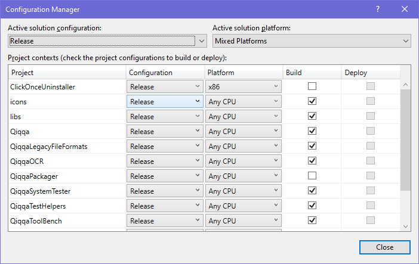

 
# *Developer Info*

## Development Software Requirements

### Mandatory

- OS: Windows 10
- Microsoft Developer Studio 2019  —— for compiling and debugging the C# code
- git —— https://git-scm.com/downloads or equivalent
- bash —— which probably already arrived as part of your git for Windows setup, e.g. https://git-scm.com/downloads
- `node` (NodeJS) & `npm` (NodeJS Package Manager) —— preferrably installed via `nvm` for Windows: https://github.com/coreybutler/nvm-windows)

### Preferred / Optional

- TortoiseGIT —— UI for git, https://tortoisegit.org/
- Beyond Compare (https://scootersoftware.com/) —— visual comparison tool, invoked by the Unit and System Tests [ApprovalTests framework](https://github.com/approvals/ApprovalTests.Net). If you employ a different equivalent tool, it may be supported by the ApprovalTests package: https://github.com/approvals/ApprovalTests.Net/tree/master/ApprovalTests/Reporters/Windows
- [Syncfusion Essential Studio 17](https://www.syncfusion.com/wpf-ui-controls) —— the required redistributable binaries are already available in `/libs/` but when you wish to upgrade SyncFusion you have to [grab it off the website](https://www.syncfusion.com/wpf-ui-controls). Commercial Qiqqa uses SyncFusion v14 and the upgrade to v17 fixed **one very annoying bug** in Qiqqa's handling of (broken!) PDF files which are already part of your Qiqqa librarie(s), and v17 isn't the bee knees in PDF processing either so another upgrade might be in order one day...

## Building Qiqqa From Source

### General Notes (before you hit "Build" in your IDE)

#### 1: *enable* Long Filename Support in git

As the repository includes "Windows Long Filenames" (at least since commit [0cf15c0d](https://github.com/GerHobbelt/qiqqa-open-source/commit/0cf15c0d4d9377e80ddafd3063cbef038701bb3e)) you MUST run this `git` configuration
command before working on the qiqqa repository:

    git config core.longpaths true

Alternatively you may try to run

    git config --system core.longpaths true

to enable this feature for all your git repositories, but that command will probably fail unless you have Administrator
right in your active shell. (See also [StackOverflow](https://stackoverflow.com/questions/22575662/filename-too-long-in-git-for-windows).)

After you have succesfully changed your git configuration, it might be a very good idea to run

    git reset --hard

next to ensure all files in the project are now correctly extracted from the git repository.

#### 2: set up your Build Configurations in Visual Studio

We provide 3 targets in the Qiqqa Solution File:

- Debug
- Release
- Release+SETUP

Only the last one is meant to build "release build" Qiqqa binaries *and* package them into a fresh `setup.exe` installer.

The packaging is driven by the building of the Qiqqa.Packager project, while the OneClickUninstaller project is a package/setup helper project which provides a uninstaller binary for that `setup.exe`.

Hence both these projects (which can take **quite** a while to build!) SHOULD be **unticked** in the Visual Studio Configuration Manager (which can be reached via Build menu > Configuration Manager).

Check the screenshot below to verify you have unchecked the correct projects in both the *Debug* and *Release* targets:

 

#### 3:

These `bash` scripts are important for development:

- `./update_CHANGELOG.sh` : this one grabs the `git log` output and dumps that into [`CHANGELOG_full.md`](./CHANGELOG_full.md), which you can then postprocess using Beyond Compare and possibly other tools to produce a viable [`CHANGELOG.md`](./CHANGELOG.md) when you are working on producing a Qiqqa release.
- `./superclean.sh` : this script blows everything away that's been written by Visual Studio in the devtree. 

  **When you run this script and restart Visual Studio afterwards, you MUST re-configure MSVS cf. to Note 2 further above in this document.**
- `./build_installer.sh` : the alternative to building the Qiqqa.Packager project and the older way to build a Qiqqa `setup.exe` installer. Less relevant today...

#### 4:

Before you run any `bash` script or build anything using your Visual Studio IDE, you should have installed `node`+`npm` on your machine and run this command in the repository base directory (a.k.a. devtree root a.k.a. the directory where this DEVELOPER-INFO.md file resides):

    npm i

This will set up the Node/npm package environment for the JavaScript/NodeJS based `bash` scripts which help build Qiqqa. Those scripts can be invoked by using `npm run ...` commands such as:

- `npm run syncver` : this command will *synchronize* all Qiqqa parts to have the same version number info.
 
  The master *major* version is obtained from the `package.json` file — Qiqqa has historically used only the *major* version number to identify a Qiqqa version. Experimental prereleases, etc. can be identified in Qiqqa Open Source by watching the full version number as it is shown during Qiqqa start up and elsewhere in the application.

- `npm run bump` : this will *bump* the Qiqqa major version number by +1, i.e. this command should be run after every official release as the next time a newer=higher Qiqqa version should be reported by the binaries to be built.

- `npm run refresh-data` : a helper script which edits the Unit Test C# source code to ensure that all test data reference files ('fixtures') have been included in the test set.

  This one comes in handy when, for instance, you add a bunch of BibTeX test files which should be parse-tested or otherwise.
  This script will find those (when you have placed them in the `TestData/...` directory tree) and add comments and code lines in the appropriate Unit Test C# source files to ensure the new files show up in the tests.

  

### Visual Studio 2019 (NEW, SUPPORTED build environment)

You'll need to obtain and install Syncfusion Essential Studio 17 as this fixes at least **one very annoying bug** in Qiqqa's handling of (broken!) PDF files which are already part of your Qiqqa librarie(s).

#### How to build the `setup.exe` installer

- Make sure you have these installed (it may work with other tools, but this is what I (@GerHobbelt) use):
  + Microsoft Visual Studio 2019 Professional (IDE)
  + [Git For Windows](https://gitforwindows.org/) - which includes `bash`
- Open `Qiqqa.sln` in MSVS
- Select `Release+SETUP` as Solution Configuration (instead of just `Debug` or `Release`)
- Build > Rebuild Solution
  + When this is done, you should have a Qiqqa.exe binary and assorted files in `./Qiqqa/bin/Release/` 
  + and a matching `setup.exe` Qiqqa installer in a `vNN-YYYYMMDD-HHMMSS` **version+date**-stamped directory in `./Qiqqa.Build/Packages/` 
  
    > The exact path is also listed at the end of the `Output` build log panel in MSVS when the 'Rebuild Solution' action has completed.
- Presto! 🎉 

>
> ### Visual Studio 2017 (Original build environment, now *OBSOLETED/UNSUPPORTED*)
> 
> You will need to download Visual Studio 2017 Community Edition and Syncfusion Essential Studio 14.1.0.41 (you can get a free evaluation key from syncfusion.com - works for single developers for private/free projects).
>   
> Then simply go to `./Qiqqa.Build/` and run `go.bat` to build the latest version into the `Qiqqa.Build/Packages` directory.
> 
> (Alternatively, when using `bash` on Windows, you may execute `./build-installer.sh` from the repository base directory to accomplish the same as when you'ld have executed `go.bat`.)
> 
  
