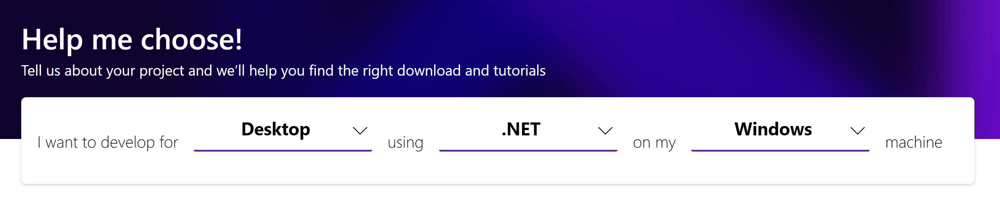

# How to build Qiqqa from source

<toc>

## Prerequisites :: setting up your development environment

Qiqqa is largely written in C#. Qiqqa is built using a Microsoft Developer Studio 'solution file' with multiple 'project files', one for each executable or DLL that's part of the Qiqqa project.

Qiqqa **software releases** are created using the Inno Setup System, which packs the relevant compiled binaries and other files into a single `setup.exe`-style installer. The `setup.exe` is produced using shell scripts, as are a few other bits & pieces in the qiqqa software.

If you want to build qiqqa from scratch yourself and/or wish to participate in its Open Source development process, which is centered around the Qiqqa GitHub repository and GitHub website, then you first need to install these tools to make sure you don't run into nasty surprises where the compile/build/packaging processes expect certain tools to be present:

- [Microsoft Developer Studio 2019 ](https://visualstudio.microsoft.com/)
- [The .NET Framework SDK for Visual Studio](https://dotnet.microsoft.com/download/visual-studio-sdks), version 4.8 or later. (Migration to .NET Core is considered, but not decided on yet.)
- git : https://git-scm.com/downloads
- bash UNIX shell - this one is included in the git-for-windows install liked above: https://git-scm.com/downloads
- node + npm : NodeJS v12 or later - since we have some JavaScript in Qiqqa and build the documentation site and other bits & pieces using Node.

  While there is a pure NodeJS installer, we advise you to install `nvm` so you can switch Node versions on your development machine. This comes in handy when you do other projects with Node / JavaScript too:
  + https://docs.microsoft.com/en-us/windows/nodejs/setup-on-windows - a nice write-up by the folks at Microsoft how to setup `nvm` and the rest
  + https://nodejs.org/en/download/ - the pure NodeJS installer. **DOES NOT include `nvm` and DOES NOT work well with `nvm` when you install that one later on!**

### Extra bits you might need later

- MSYS2 - or another way to get at tools like `wget` et al on Windows. Not mandatory and certainly not advised to install on a first try / first meet date with Qiqqa sources.
  + https://www.msys2.org/#installation - MSYS2 installer
  + https://docs.microsoft.com/en-us/windows/wsl/install-win10 - Microsoft's new approach: Windows Subsystem for Linux a.k.a. WSL or WSL2. Use this if you want/need something stronger than MSYS2.

