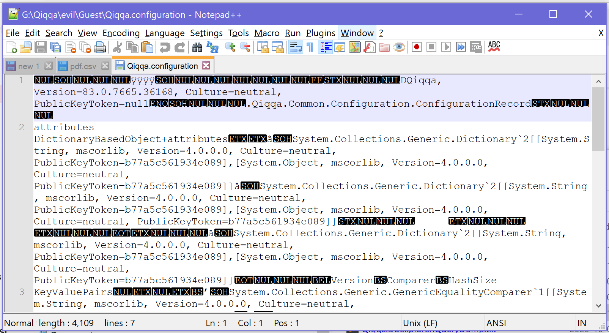
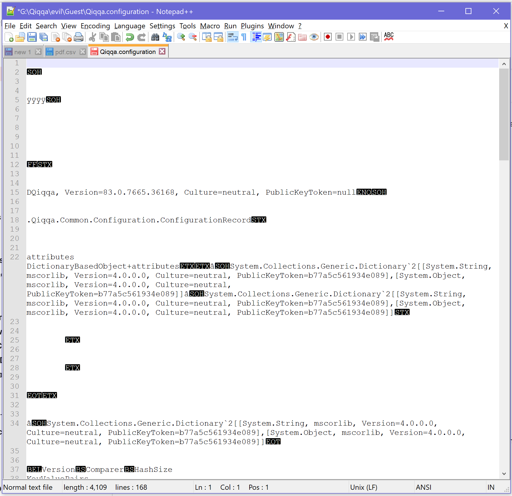

# I've forgotten my Commercial Qiqqa's Cloud Storage username/password

**WARNING**: this will work as long as you still have access to a machine with a Qiqqa install which can still connect to the Commercial Qiqqa's Cloud storage.

If you are not that lucky any more, BUT still have access to a machine (with Qiqqa installed) where you **successfully** logged into Commercial Qiqqa's Cloud Storage, then you **MAY get lucky** using the procedure below.


# How to extract your Commercial Qiqqa Cloud account info from your own Qiqqa configuration

TBD: copyedit this copy/pasta'd article.

---

I may have a way to recover your password from the Qiqqa configuration file on your original machine: it MAY be available in the Qiqqa configuration file there. 

It's a bit hacky and you'll need [Notepad++](https://notepad-plus-plus.org/) (or similarly capable editor) for this -- [Notepad++](https://notepad-plus-plus.org/) is a free text editor and can be found here: https://notepad-plus-plus.org/

OK, the steps:

1. on the machine where you can still access your Qiqqa Cloud, we'll call this the "*original machine*", your libraries are stored/cached locally. All that data is stored in a directory tree which starts at the "*Qiqqa Base Directory*". 

   You'll need to go to that directory. If you don't know where it is, see [How to locate your Qiqqa Base Directory.md] 
   
2. inside that directory, there's a `Guest` directory: this is where the base library is stored AND the Qiqqa Configuration file(s)! 

3. there you should find the `Qiqqa.configuration` file.

4. COPY it to another directory so WHATEVER HAPPENS NEXT, that file will *not* be damaged!

5. open the copy in Notepad++. It will look like a whole bunch of cruft, e.g.:



6. We now need to dig out the two stored `Account_XYZ` variables and to do that more easily, we're going to replace those `NUL`s with *linebreaks* in Notepad++. The (keyboard) commands follow:

   - **Ctrl+H**  will pop up a find&replace dialog:

     

   - Click the `Extended` radio button as shown in the screenshot above.
   
   - Enter `\0` in the *Find* input box as shown in the screenshot. (`\0` means: `NUL` byte)
   
   - Enter `\n` in the *Replace* input box as shown in the screenshot (`\n` is programmer speak for *LINEBREAK*)
   
   - Click the *ReplaceAll* button to have all `NUL` bytes in there replaced by line breaks. (*this is why you need to copy the config file: if you accidentally save this mutilated version, your Qiqqa config would be damaged and we'ld be in a real pickle!*)
   
   - *Close* the dialog. Your config file copy should now look something like this:
   
     

     which looks more like a regular (but still a bit crappy) text file with lines of text.
     
7. we now go and find those `Account` settings:

   - **Ctrl+F** will pop up that dialog again:
   
     

   - In the *Find* input box you enter `Account_` as shown in the screenshot.
   
     Doesn't matter if you're still in Extended Mode or Normal Mode (as shown in screenshot) for this search.
     
   - Click *FindNext* button to find the first occurrence of that text, then click *Close* to close the dialog:

     

   As you can see in the screenshot, Notepad++ found the `Account_UserName` slot in your config file. Because it's wrapped in binary data, it's a bit crappy, but the DATA for that slot is in the first non-empty line after that: that's
   
   ```
   cab93ba8-eb78-4c31-b0ea-5d6f02d96a82
   ```

   in my case (compare with screenshot above). 
   
   Note that I did not include the first character on that line as it's *not* part of the actual value but part of the surrounding binary data that was in the original config file.
   
   In your case, I expect to see an email address or username there.
   
   **Ditto** for the next slot, just a little lower (see screenshot above): `Account_Password`.
   
   Same logic here, so the password would be:
   
   ```
   827d5834-9749-489c-87e1-0e2af3b1777e
   ```

   Again, that's *without* the first character of that line as that is part of the surrounding binary goop.

Try these at the Commercial Qiqqa's Cloud Storage site andsee if you got lucky.

**That's it!**

# !BIG FAT WARNING FOR EVERYONE!

See also https://github.com/jimmejardine/qiqqa-open-source#warning-notice-for-commercial-qiqqa-users-with-a-user-account-and-web-libraries

Quantisle has already announced in 2019 that they will discontinue the Cloud Storage service somewhere in Q4 2020. 

As of this writing, we already live in 2021 AD and you are **very lucky if that Cloud Storage is still accessible**. What I hear from others (I (GerHobbelt) don't use it as I use Open Source Qiqqa and don't have a live commercial account any more) is that it was still up in May 2021, but as the car salesmen say: *YMMV (Your Mileage May Vary)!*

