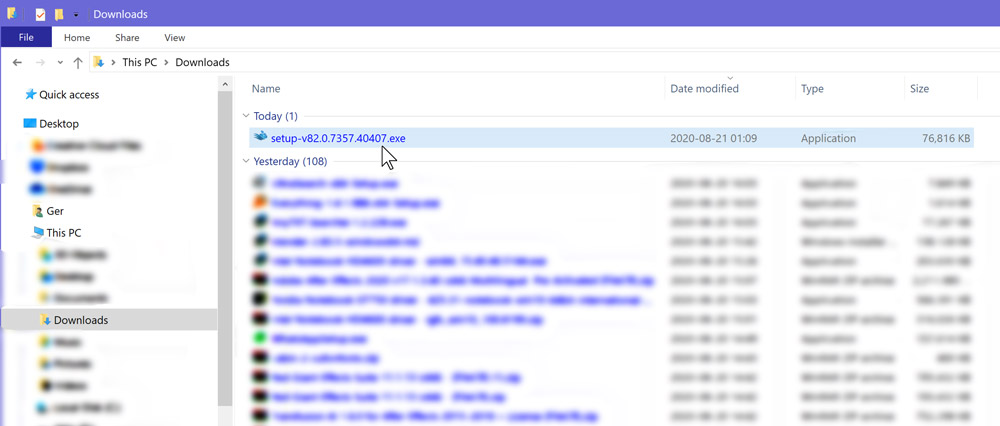
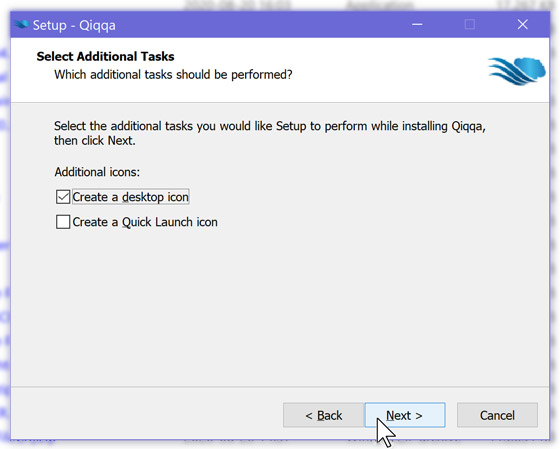
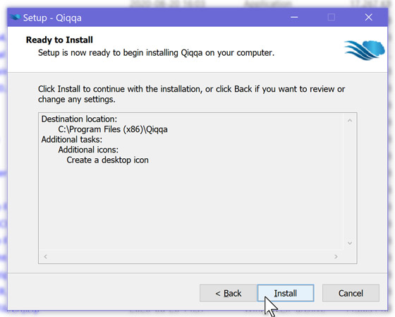
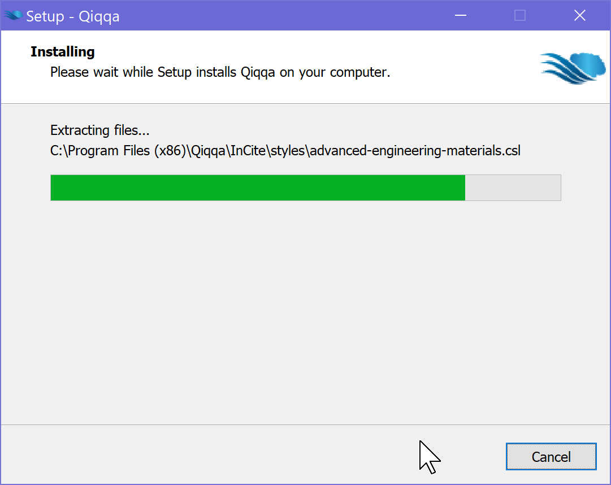
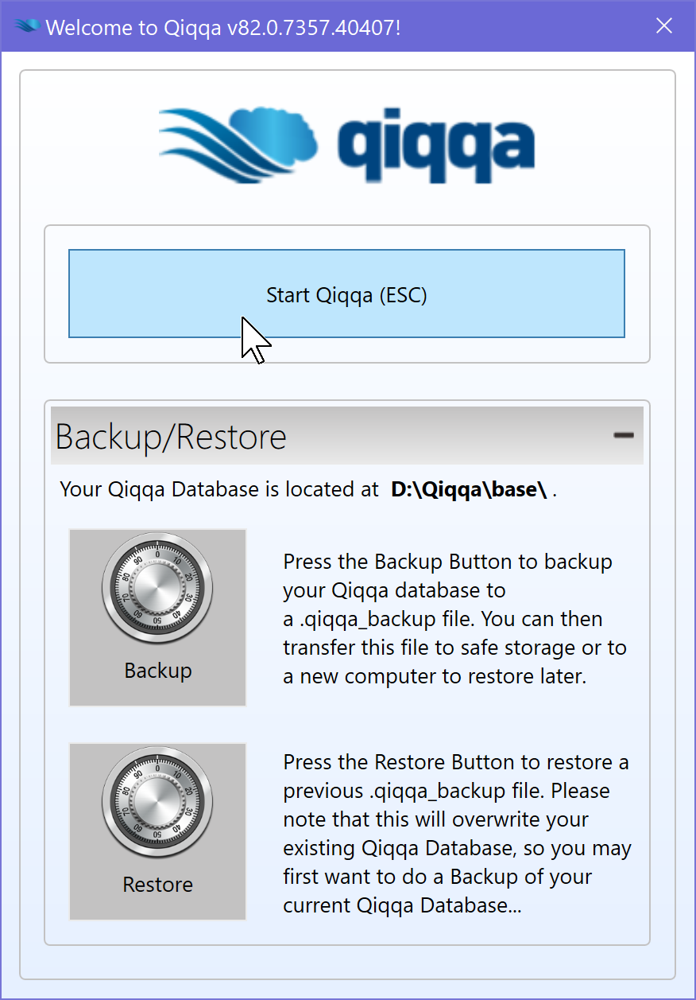

# Installing Qiqqa / Updating Qiqqa

## Before I update: will my data remain intact?

Yes, your data is safe. Open Source Qiqqa versions v80 and all v82.*** releases are binary compatible with the last commercial Qiqqa release: v79.

If you ever want to revert to an older Qiqqa release, simply run the `setup.exe` for that version and answer when the installer asks you whether you want to install over a *newer* version like this:

> <small>(Don't mind the v85 version mentioned in the screenshot above: that's just me running some bleeding edge Qiqqa code with an incorrect version number, that's all!)</small>

## Where to download latest Qiqqa?

You can find the latest (beta) releases at https://github.com/GerHobbelt/qiqqa-open-source/releases -- this is the repository where the main development of Qiqqa takes place and new releases are published first.

[Here's a short video showing you how to get to that page via Google](https://vimeo.com/449925616) and how to download the latest Qiqqa Setup/Install EXEcutable from that page. 
**Jump to 0:28 in [the video](https://vimeo.com/449925616) if you used the https://github.com/GerHobbelt/qiqqa-open-source/releases link above.**

Once you have downloaded the `setup-v**.*.****.*****.exe` from the *Release Assets* as shown in the video, you should find the downloaded file in your Download folder:

## Installing / Updating Qiqqa using the downloaded `setup` installer

When you double-click on the installer, it will probably pop up a [Windows UAC (User Account Control)](https://docs.microsoft.com/en-us/windows/security/identity-protection/user-account-control/user-account-control-overview) dialog requesting access to your machine.

Answering **Yes** will continue the installation (**No** will abort the install process).

>
> ### When the install is an *update*
>
> The Qiqqa installer will immediately check whether you already have a Qiqqa version installed and will pop up this dialog when it has found it:
>
> 
>
> > <small>(Don't mind the v85 version mentioned in the screenshot above: that's just me running some bleeding edge Qiqqa code with an incorrect version number, that's all!)</small>
>
> I suggest you simply click on the **Yes** button there. (**No** will abort the install process.)
>
> The old Qiqqa software version will be removed:
>
> 
>

### The install process <small>(it's mostly *Next-Next-Next-...-Finish* as usual for Windows installers)</small>

We're showing the sequence of screens you will see while the installer runs. Click **Next** where appropriate.

Then click on the indicated radio-button to **accept the license**:

and hit **Next** to continue:

Use the default install directory for Qiqqa, so we just hit **Next** in the next screen:

I like to have a Desktop icon for Qiqqa, but that's up to you if you want one or not. The default setting is to keep your Desktop *clean*, so Qiqqa will then only appear in the Windows Start Menu.

Anyway, another **Next** it is...

Now all 'setup / configuration' has been done.

Click the **Install** button to execute the installation process.

Here's the install process at work (you don't have to do anything; just wait until this is done):

... *aaaaaand* we're **done**!

Since the 'Launch Qiqqa' checkbox is ticked by default (click on it to turn it of if you want that), Qiqqa will be started by the installer immediately *after* you click on the **Finish** button.

This is the end.

The next few screenshots are Qiqqa starting on an 'empty' machine, i.e. a machine without any Qiqqa libraries.

Splash screen:

No need to log in any more as Open Source Qiqqa does not have Qiqqa Cloud access (see further below if you need that) as all networking code was removed from Qiqqa before it got Open Sourced.

Click the **Start** button to start working:

Now Qiqqa will take a little while to inspect and load the Qiqqa libraries:

Qiqqa is ready and responsive by now. The Guest library is shown by default.
Click the **Home tab** to view your libraries list:

this example only has the default Guest library as this was an 'empty' machine in the screenshot below. The list in your **Home tab** is very probably much longer, unless you are a new Qiiqa user or are running qiqqa on a fresh machine...

That's it for now!

## Exiting Qiqqa

Click the **red X** in the top-right corner to exit the Qiiqa application:

Qiqqa will ask you about your *exit preferences* and persist your choices for the next time you start Qiqqa.

Bye bye!

---
---
---

## Qiqqa and Qiqqa Cloud libraries, a.k.a. Qiqqa Web Libraries  <small>from the time you were using Commercial Qiqqa and had a *paid account* which included Qiqqa-specific cloud storage and an access management website to manage your cloud libraries</small>

The way Commercial Qiqqa worked was to keep a local copy of your Cloud-stored libraries, which you have to *sync* when you work on mutiple machines and/or were collaborating with other folks on those same libraries.

Open Source Qiqqa will auto-discover your old **commercial Qiqqa Cloud** repositories, which are stored locally and list them as part of the libraries overview. 

Be aware that the names for these libraries *may* be a wee bit cryptic and not what you're used to before. 

**Qiqqa Cloud is NOT accessible by the Open Source versions of Qiqqa as the required code was not published by Jimme Jardine nor was it reverse engineered.**
Hence you **must** install [commercial Qiqqa v79](https://github.com/GerHobbelt/qiqqa-open-source/releases/tag/v79) and manually **sync** any Qiqqa Cloud libraries if you fear your local copy is *older* than the library copy stored in Qiqqa Cloud. Once you have **synced** all your Qiqqa Cloud libraries using that commercial version (installer available here: https://github.com/GerHobbelt/qiqqa-open-source/releases/tag/v79) your local copies will be up to date and you can install the Open Source Qiqqa (any v82 or v80) to *auto-discover* these and retain acess to your collection.

### BIG FAT WARNING

Jimme Jardine has stated that Qiqqa Cloud will be only kept around until Q4 of 2020 AD, so you better make sure you sync **now** if you are worried about your cloud libs.

Iff, for whatever reason, you cannot access your Cloud storage any more but do know someone or some machine where a more up-to-date copy of your library/ies are stored locally, then Open Source Qiqqa can import those more up-to-date copies. **This is however a bit of a hacky feature at the moment and requires another write-up so you can read how it is done and what you can do when you happen to encounter a very stubborn/malign copy of a Qiqqa library somewhere. 

For this document that stuff is definitely *out of scope*.

