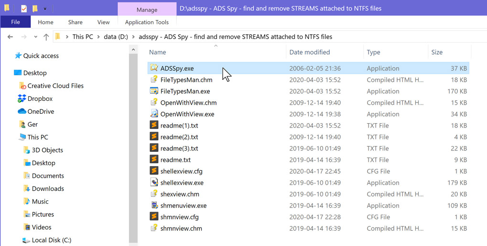

# Problems with running the installer on your Microsoft Windows machine

> ---
>
> The info below applies to all executable content that you download from the Internet. These issues are *not* Qiqqa specific.
>
> ---

- when you encounter this: 

  > Windows protected your PC
  >
  > Microsoft Defender SmartScreen prevented an unrecognized app from starting. Running this app might put your PC at risk.
  > 
  > App:
  > setup-v82.0.7357.40407.exe
  > Publisher:
  > Unknown publisher

- or when the Windows App Store pops up when you double-click the installer

- or for some hard to diagnose reason the installer **will not run despite the download apparently having succeeded without any errors, using your Chrome browser**

... then it might very well be your Windows machine attempting to protect you from 'unknown executable content downloaded from the Internet'.

This is not magic, but is signaled internally via [ADS (Alternative Data Streams)](https://docs.microsoft.com/en-us/archive/blogs/askcore/alternate-data-streams-in-ntfs) [\[Ref2\]](https://blog.malwarebytes.com/101/2015/07/introduction-to-alternate-data-streams/) and you should then be able to remove this blockade by using a tool to remove the *Zone 3* ADS: [ADSSpy by Merijn Bellekom](http://www.merijn.nu/programs.php) [(ADSSpy github repo at this link)](https://github.com/mrbellek/ADSspy)

## Removing the ADS info (invisibly) attached to your downloaded file(s)

Here's an example of some *Zone 3* ADS content for an image which I downloaded:

The same type of information is attached to your downloaded installer / executable and that is recognized by Windows internally and making it reject your double-click-to-execute that file waiting in your Downloads directory (or elsewhere).

### First you need to fetch the ADS Spy tool

You can [download ADSSpy from Merijn's website](http://www.merijn.nu/programs.php) as a ZIP archive file, which you can extract locally to a directory, resulting in something like this:

> Aside: I have several ADS-related tools in that directory on my D: drive, hence the longer list in the picture above.

As the ADS info is not copied onto the extracted ZIP contents, you can freely run the `ADSSpy.exe` tool by double-clicking it.

### Set up the ADS Spy tool to find the setup / installer executable you're having trouble with

When you double-click ADS Spy to run the tool, this dialog will show up.

Make sure to chnage these items in the dialog:

- **turn off = UNcheck the tick box** "Ignore safe system data streams" -- if you don't the *Zone 3* ADS streams will *not* be found and you will be unable to remove them.

- **select "Scan only this folder"** and click the little \[..\] button to the right to select your Downloads directory (where you have your offending setup / installer executable stored on disk)

Now you're ready to **click the "Scan the system for alternate data streams" button**: ADS Spy will now scan the selected directory and every directory in it and show all files with ADS attached in the list, like this:

In the picture above, we've highlighted the downloaded Qiqqa installer already and **ticked the checkbox**: *only the ticked(=selected) entries will be processed when we hit the "Remove selected streams" button* next:

ADS Spy will then pop up a "Are you sure?" dialog to check:

where you click "Yes" to remove the ADS data.

### The result of this activity

*You won't see anything different in your Windows Explorer* but you should now be able to double-click the setup/installer executable you downloaded from the Qiqqa/GitHub releases web page and proceed with the install process, which is described in the [Install Qiqqa / Update Qiqqa][1] web page.

  [1]: [[Installing Qiqqa - Updating Qiqqa]]
