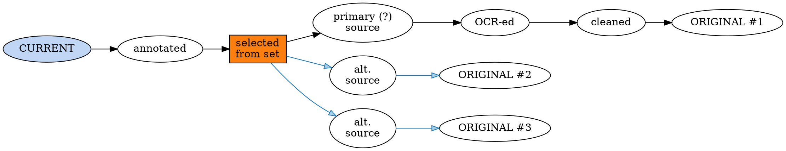
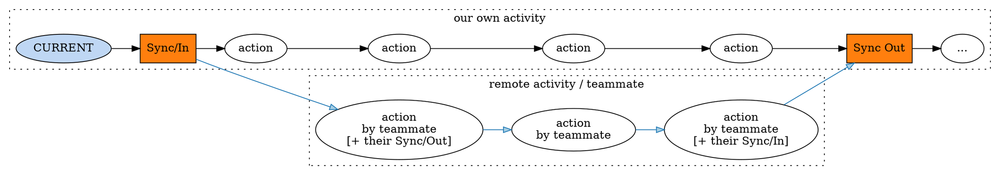

# Considering the Database Design :: we want ... PDF and BibTeX \[*metadata*] versioning, *conflict resolution* on sync\[=merge], ...etc.

Brooks project version 2 syndrome? I hope not!

Here's a non-exhaustive list of Qiqqa deficiencies that I intend to tackle in due course:

- there's no undo/redo across application runs: once you've altered a BibTeX metadata blob or other metadata item, it gets written to database automatically and **you are toast** iff you decide at a later time or *date*: 🤔 "*that edit wasn't so smart*". 😕 Qiqqa doesn't keep old copies of your data.
  In version control parlance: Qiqqa doesn't keep any revision but the HEAD.

- Qiqqa doesn't cope well with PDFs, which are *processed* subsequently: every binary differing document gets its own slot in your library.
  This becomes a serious maintenance problem when you have PDFs, which, f.e., are protected or otherwise not of *library quality*, and you go and *process* those PDFs through various means to make them suitable for every-day use. These processes MAY be (but are not limited to):
  + removing obnoxious print protection, text copying ("clipboard") protection, etc.
  + removing useless banner pages (I'm looking at you, OnSemi! 😵)
  + OCR-ing the content and producing a PDF with text overlay for library use[^1]
  + revising original content (either by yourself or by having an external source effectively doing so: thing ArXiv v1,v2,v3,... published PDF revisions for one way; you correcting OCR or render/typing errors in a PDF is another.[^2])

[^1]: Qiqqa handled this by OCR-ing the original PDF and storing the OCR text output in separate cache directory. However, this only "works" if you do not intend to export or (post-)process that extracted text. When we also consider the wish to have the ability to export PDFs including user annotations for a user to edit at will in an *independent external package* and then possibly re-submit the augmented (thus *altered*) PDF, then this is highly inadequate. Hence the PDF-to-PDF process mentioned here: OCR results SHOULD be fed back into the PDF so it can be revised/corrected/cleaned-up/whatnot in subsequent passes by whatever means necessary.

[^2]: Did I hear "*revision control system*" from the back row? Indeed, it looks like we're on the way to requiring yet another RCS, alas. As we intend to keep using SQLite, it'll probably [smell like `fossil`](https://www2.fossil-scm.org/home/doc/trunk/www/index.wiki) and now I wonder why we don't just take that one instead of spending the future effort to create our (limited & slightly different) own. 🤔

* while Qiqqa has some functionality to discover *duplicates*, it does so solely by comparing *metadata*. Updating their metadata as a group (batch), picking a preferred copy, etc. are user actions which require some work-around activity, e.g. judicious use of *tags* to keep those discovered PDFs related to each other as a "group", making Qiqqa less than ideal for working with an unfiltered/raw PDF feed.
  What I am after is a rather more mixed bag of (*semi-*)duplication:
  + multiple origins: I have downloaded PDFs multiple times in the past without noticing immediately; sometimes / often these PDFs have been minimally (or significantly! header pages!) altered by the different download sites, resulting in Qiqqa seeing binary-different content and thus marking those as independent PDF document in its library. Wouldn't it be great if we could make Qiqqa discover these "*almost, i.e. **highly probable** duplicates*" and help us by permanently marking them (following our explicit approval or tentative general go-ahead[^3])
  + processed copies. From the PDF processing list above: all of those will produce yet another binary-different PDF file, which SHOULD be related to the original PDF to ensure we'll be able to auto-propagate any metadata, etc., that hasn't yet been set up for the *derived copy*: that will save us a bundle in metadata maintenance as *derivatives* would thus be able to automatically pick up metadata from their parents. (🤔 Or should we percolate/inherit in the *other direction*: latest metadata inherits *downwards*, while only a total lack of metadata in the HEAD would suggest we assume any parent's data as a starting point.)
  + annotated copies, ...: processed copies by another name. Would result from exporting a PDF+annotations, to be edited by external means and subsequently resubmitted into the library. Would be *great* if Qiqqa could detect such *near-duplicate* and add it accordingly.

  
[^3]: when you are processing large libraries, you don't want to be bothered every second by yet another bunch of *probable-dupes*: you want that process to run and take as long as it takes while you do other work, **then** go in a review the result **afterwards**. Qiqqa already has this (though admittedly *hacky*) for BibTeX discovery through the Sniffer: `@comment{auto}`, but now we need this to be feature *throughout*. Plus that review-after-the-fact bit, necessitating a separate query, markers, and the report+edit UI for the user to tweak & okay the results.

---

## We need a revision control system?

Sounds like we do. That way, we can relate any *semi-duplicate* PDFs as mentioned above by adding them as *revisions* in a **commit tree**.

Ditto for metadata edits and (multiple) imports: anything related SHOULD be added to the revision tree.

Another user action that mandates a revision control system, or rather a *collision resolution mechanism*, is Qiqqa Sync: when you work in a team (or alone on multiple computers), chances are that you'll encounter **collisions** in submitted metadata for a given PDF. Current Qiqqa copes with this by picking the incoming edit no matter what. Which potentially looses you some valuable work.

When we say "*collision resolution*", this implies we'll have to redesign the Sync process entirely. When we keep in mind the issues and ideas mentioned further above, we are looking at a **tree merge** action in revision control parlance. And that's something that's taken quite a bit of effort for `git` and others to get right, so realizing this made me wonder whether I should roll with an existing revision control system instead of rolling my own. 🤔 There are arguments for not taking that route though:
- backwards compatibility -- more or less, depending on where we take this
- those systems are usually not single-file, while our current database is (the only chunk we currently Sync). Keeping it simple? 🤔
- we have some special needs[^4], that you won't encounter with regular software development, thus making the available revision control systems an ill fit.
  
[^4]: while software development revision control systems are *filesystem oriented* and thus *hierarchy oriented*, our data relationships are more a loose *graph*: we have *strong* and *weak bonds*, for example. See below.

The preliminary conclusion is: yes, we need a revision control system. Unfortunately, nothing out there really fits the bill, so we may have to roll our own.

## Commit analysis: what do we need? What does our graph look like?

### For PDFs

For PDFs, there's several actions we wish to record:
- PDF file import (a.k.a. "original import")
- deprotect (security change)
- cleaning (automated content/file data cleaning a la `mutool clean`)
- selection (*deduplication*, i.e. user or automaton picking a "chosen one" from any arbitrary set of PDFs)
- annotate (adding or editing PDF-embedded annotations)
- revise (editing the PDF content)
- *retract* (see also below; marking a paper a *retracted*, either in part or in whole, is a significant event. Retractions are a special kind of *revision*, where the publication might even be removed from the source site entirely.)
- ...

Example *commit graph* for a single PDF:

As shown above, the **selection** commit signifies *deduplication* of some kind. We recognize these kinds *at least*:
- reprint
- alt. source (i.e. a second site where this content was made available for download, but MAY OR MAY NOT have been formatted slightly differently; at least enough for the PDFs to be binary different.)
- bannered \[alt. source] (this particular duplicate has a banner and/or tail page added to it, without any worthwhile *new content*)
- revision (think ArXiv v1,v2,v3,...)
- *retraction* (though I think that should be a separate attribute / metadata commit as well, so you can query on retracted documents)

### Metadata / BibTeX

Here we expect to see the same sort of commit graph as for the PDFs. We feel, however, that metadata/BibTeX MAY benefit from being managed separately:
- you may import multiple BibTeX/metadata sources for the same PDF. Cleaning and *selecting* them would be rather independent of PDF file change: shouldn't we use a different kind of commit record for such activity? (as the related PDF doesn't change a bit itself)
- when you "*select*" metadata/BibTeX, chances are you're rather more *remixing*/**merging** the metadata than pure *selection* as we've seen for the PDF files -- where merging like that would be pretty hard to do.

When you import, mix & merge BibTeX/metadata like that, this activity is rather independent of the actual PDF file as the latter won't change a bit while all this happens.
Either we then have two commit trees (one for the PDF sequence, one for the metadata work), or we have them combined into one, where a "*commit*" then would NOT imply there's changes made to the PDF any more[^5].

[^5]: on retrospect it so happens that the "*selection/choice*" commit as shown in the PDF commit tree already is a *non-modifying commit* like that: it only picks one of the already existing PDF files. Thus it is arguably sensible/sane to include any *metadata edits* as additional commits in the PDF commit tree.

## Commit tree for all activity

Now that we have a tentative conclusion that metadata and PDF file changes all will land in the same commit tree, that tree will see a large increase in records (metadata edits happen often and in small steps), so we ask ourselves: 
1. can we speed up tree view queries, i.e. queries where we are interested in the history of the "*current*" PDF? Or the history (backwards and forwards into the future) for any other PDF in the chain?
2. can we **fold commit chains** when we decide a set of commits in there is now obsolete? E.g. when we want to discard a set of intermediate metadata edits; or when we want to reduce library storage pressure by discarding some intermediate PDFs, such as the *cleaned* version in the example graph above: we always want to keep all originals and the CURRENT/HEAD item.
3. how do we cope with Qiqqa Sync now? We have a commit graph and the incoming "*sync copy*" MAY have *other* commits as multiple members of the team work in parallel on the same documents: this sounds like it requires a full-fledged collision detect-report-and-resolve subsystem!

## Performance considerations

As asked above:

1. can we speed up tree view queries, i.e. queries where we are interested in the history of the "*current*" PDF? Or the history (backwards and forwards into the future) for any other PDF in the chain?

I believe we can. Assume the usual database layout for graph/tree-oriented data: a RECORD table (which we'll call `"COMMITS"`) and a LINK table (which we'll call `"RELATIONSHIPS"`) .

Writing a query to obtain the entire commit tree from the example graph above would be relatively hard, as we would need to analyze the *links* to an arbitrary depth, requiring either serious *query wizardry* or looping/recursion in the calling code, issuing several (fast) queries, until our tree depth has been depleted.

A regular LINK table has two fields:
1. parent / source
2. child / destination

We'll use the parent/child nomenclature, while we **do realize a DAG (directed a-cyclic graph) is not hierarchical** and it would thus bee more fitting to use source/destination. Sorry, my brain does parent/child for that as well, so parent/child it is.

Now, for *performance*, we ask ourselves: can we write that arbitrary-depth/nested query as a single query, without crazy joins and whatnot?!

Yes, we can.

## Weak bonds vs. strong bonds

Here's where we introduce the concept of *strong bonds* vs. *weak bonds*: *strong bonds* are those where we concern ourselves with action which is *particular to this PDF*, rather than *universal*/*group-oriented*. Examples of strong bonds from the commit types listed further above:

- PDF file import
- deprotect PDF (security change)
- clean PDF (a la `mutool clean`)
- annotate PDF (adding or editing PDF-embedded annotations)
- revise PDF (editing the PDF content)

meanwhile various metadata edits are also *strong bonds* for the PDF concerned:
- mark as: primary source / reprint / alt. source / bannered / revision / *retraction*
- edit BibTeX / metadata
* add source URL (i.e. specify more spots on the web or elsewhere where this PDF was / can be obtained; as links go "*stale*" pretty quickly on the net, we have another argument right there to NOT make difference between links that *were* a source and links that *are*. 
  Users MAY however desire to have a function to mark a given source as a *currently verified source* for a given PDF a la Wikipedia, where they mention something along the tune of "*last verified/downloaded at 2022/03/27 from URI*". This implies an extra source metadata attribute: `last_verified_on`.

You get the drift: anything that's unique to a given PDF or transforms that PDF 1:1 to another *unique PDF* is a commit with a *strong bond*.

The "*selection*" commit mentioned earlier is the odd one out: while that one takes several source PDFs and maps them to a single (output) one, we consider that one a *strong bond* for purposes of our query speedup when we wish to see the "entire commit tree" (or a significant part there-of).

Examples of *weak bonds*? We haven't talked about those relationships, but they are, on the one hand, NOT commits, while it can be argued that creating them *is* an action and hence a commit:
when we group/bundle PDFs to form a group of any kind:
- "related material" (where you would have a "source" PDF, so the "related" is meant in relation to *that one*, not equally distributed to each other. Think "related publications" link in Google Scholar, below every entry listed there.
- "related material" as more of a *group thing*, i.e. a *common interest*: this mandates at least a `group_title` attribute so we can name this group, e.g. `"neuroplasticity"`. 
  Do I hear "*tags!*" from over there? Yes, indeed. This certainly smells a lot like *tags*. Should we use those? Or do *tags* serve another categorization purpose? Or shouldn't I differentiate between these categorization levels? (I was thinking "*groups*" as small, rather specific/dedicated subsets in the PDF collection, while tags are hard-pressed to produce and manage that level of granularity easily.) 🤔 ==> seems to me now that we'll be best served by storing *strong bonds* in the LINKS table, naming it `BONDS`, while the *weak bonds* should get their own independent LINKS table called `RELATIONSHIPS`. *That* table would then include fields to allow each *weak bond type* to be named (and possibly commented/described): `name` + `description` + `notes` as extra fields there. This would make it a suitable table for:
  - PDF tags (shared among otherwise independent PDFs; applies to all commits in the commit tree)
  - "State" tags/attributes: bind to a set of specific commits, e.g. "revised"? 🤔 Not sure if I like this...
  - persisting analyses, e.g. cross-ref (a.k.a. `@mention`) investigations, Qiqqa Explorer graphs, etc.

A corollary of this *weak bonds* idea is that:

- Qiqqa libraries are now simply a **subset** of the main PDF repository: your libraries *pick* the PDF/commits they want and leave out the rest.
  + Incidentally, this implies we need to mark such picked commit records as "*will auto-track HEAD, i.e. auto-update*" vs. "*MUST NOT update as we mean to reference this precise commit and do not desire to move forward*". This flagging should be done on a per-PDF/commit, per library basis. Default setting: auto-track. It would bee a specific library purpose requiring *not moving forward at any time*, e.g. a library representing the exact set of referenced publications (version an' all) for a publication/paper of your own: one library per paper for you.

### How does that pan out re Sync and *security*?

Of course, when we keep a single larger PDF repository and turn the Qiqqa libraries into mere link sets into the single repo, there's a risk due to data and/or software bugs of sharing sensitive material that doesn't belong in the given directory when Syncing.

The second issue is with multiple shared libraries, where other team mates feed back different annotations and/or metadata edits for the same PDF, only because it appears in different libraries. 
This would be a scenario where the commit tree would split and have two CURRENT records, one for each library. CURRENT, therefor, is to be considered like a `git` HEAD: it's only HEAD from *your current perspective* and has no special worth beyond that: those two libraries in this scenario would each have a different HEAD=CURRENT record, thanks to those disparate merged/remixed metadata records.

But... can we, if we like thus, transport or merge such disparate branches in the commit tree?
Yes, we SHOULD. If the user desires to "pull" the changes from another library into the current one, these disparate commits should be fetched and merged; collision/merge resolution as usual, since this is technically no different from merging a Sync Source: you have thee same potential problem there as *you* may have worked on a PDF/metadata since your last Sync/Upload, while your teammate may have done as well, so now that you re-Sync/download, you are potentially facing a collision and Qiqqa SHOULD provide means to resolve those; preferably better than the current "keep local", which will overwrite the remove edits once you progress to the next Sync phase: Sync/Upload.

> TODO: somewhere I said current Qiqqa does a 'take incoming'. Check the Source and Decide Which Is Which, Luke!

### Do we *need* the notion of  *weak bonds* at all?

If we wish to persist arbitrary grouping of PDFs, whether from automated analysis runs (Explorer, LDA / TF-IDF based similarity searches, etc.) then it might be handy to have; I can see how we can do without -- those relationships would simply have their own tables, but somewhere in the back of my brain is the intuition: better keep it.

## Performance: fast and easy retrieval of commit tree

Given the above (RECORDS=COMMITS + LINKS=BONDS tables forming the *strong bonds only*-based commit graphs), we augment the LINKS table with an extra database-global-unique field: `element`: this can be any number or identifier as long as it's unique versus other commit trees stored in the LINKS table. It MAY even be the *hash* of the CURRENT PDF -- though you can see trouble nearing on the horizon when you consider one-repo-for-multiple-libraries: potentially you'ld have two or more CURRENT commits per PDF there: 😨 *oops!*[^6]

Better to stick with a machine-generated number then?[^6] (TODO: how about Sync? How to match this when obviously different numbers are incoming from another machine?)

Now we assume all commit records in the commit graph for this PDF have the same `element` id.

### Analysis

- It works when we add a new commit: simply pick up the existing `element` id and use that as part of your `INSERT`. Cheap, as no extra work is required -- worst-case you have one cheap query to re-fetch the CURRENT/HEAD commit record to get the `element` id.
- "selection" commit? That one takes a bit more work. When such a commit is added, the referenced subtrees need to be completely `UPDATE`d to assign each record the new `element` id.
  
  > Hm, that's not nice when you wish to *revert*/*undo* the select action: once you *disconnect* the select, each subtree must be inspected to find if it is now entirely *detached* from the CURRENT and only when it is MUST it be renumbered in its entirety -- it isn't detached when there are other "*select*"s still pulling in \[parts of] this subtree. All this involves a potentially large number of commit & link records in the undo `UPDATE` database action. An ameliorating thought here is that *undo*-ing a *select* action is expected to be quite rare: how often do you expect to undo work, really?

* Import/merge from Sync Source: we WILL find those LINK records will have quite different`element` ids, particularly when we have teammates working on the same database. However, those commit trees can be matched against ours as one thing's for sure: a single PDF file (and thus a unique PDF hash) cannot legally exist in two different commit trees! If it could, we would be able to involve a single PDF in multiple, **fully independent**, metadata and content development trees! Why would you do that? Arguing that different libraries may need different "*views*" re certain PDFs is an argument for a  _commit tree **branch**_ instead: you can do anything like that (give a PDF different metadata and other attributes) when its commit tree is branched. There's no need to allow a single PDF in multiple independent commit trees. And *hence* we can simply match those incoming foreign commit trees to our own, 1:1 for every PDF document. Which results in an easy renumbering approach -- or ~-mapping so we can quickly discover whether our commit tree is different from "theirs" and decide whether any work must be done to merge the two... Not super-easy like it was before with Qiqqa, but I don't see screaming costs surfacing here either.
* Security of edits vs. another library? When we have two libraries, each with their own branch and thus desired metadata for a shared PDF, then their historic commit tree up to the point where this PDF is assigned and the commit tree branches, is shared among the two libraries. That is proper behaviour as anything leading up to this PDF is common history.
  The library-specific stuff sits in its own branch and it MUST NOT access our branch: this is a security issue in the software as the fast SQL query will produce the *entire* commit tree, *including both branches*. 
  > If you don't want that, I don't see any other way than separating that library *entirely*, i.e. *detach* it from the general repository. This would be similar to running a remote library copy, where you are working on the Sync DB, so to speak: PDFs, commits, everything, is kept separate.
  > 🤔🤔🤔 May I suggest "**Qiqqa Safe Mode**"? The idea being we spawn an additional ("Safe Mode") Qiqqa instance on your machine, which is meant to *solely* manage that particular library, completely independent from this Qiqqa instance (+ backend tools); different base directory, *the works*. That way you have your data security breaches minimized to the absolute minimum: there won't be any shared data between that library and the rest of us. 
  > Plus you can always load/import it by using Sync: you Sync/Upload from the Safe Mode instance, then Sync/Import from the general instance and presto: your data has been incorporated. (At least that's the idea here. I still will need to code this! 🥶 )

[^6]: Following the suggestion of "Qiqqa Safe Mode" above, an important note about `element` id is due: it MAY be a hash of any of the PDFs *participating in the commit tree* as those are guaranteed unique numbers. This is safe as this is not used as a *document identifier* but rather as a *system-unique number* only. And it works for that! Even if we take the local machine 64-bit `id` which is mapped to the larger *document hash*, we'll still be solid, as that 64bit index/mapping number is guaranteed unique to the related PDF and since that PDF we picked is part of this commit tree, we're golden.[^7]

[^7]: Of course, when we go "Safe Mode" with a library (or otherwise Sync/Out for that matter), we MAY be using the `element` id for a PDF that's in an **unreachable branch**. In that case, we can swiftly renumber the entire commit tree using the `element` id for any other PDF in there.[^8]

[^8]: And non-PDF-carrying slots you say? (Qiqqa has those: where the PDF is pending/not-included but we *do* have metadata we wish to track & manage.) Here we pull a John Wayne by stating that any record like that will receive a random **dummy BLAKE3 hash**. Damn, we'll need a cryptographically secure random generator after all (OpenSSL et al provide such, so no sweat) as taking the hash of the metadata is NOT going to cut it: I am fully okay with the very same (near empty, for example?) metadata to be identical for multiple **independent PDFs**: a `null` entry should therefor get its own unique hash/identifier, which would be 'replaced' by a later 'load/bind' commit, where we *bind* a given PDF to the already existing metadata record... Easy as pie! 🤪

## Conclusion

COMMIT table:
- *commit id*
- PDF id: the document this is about
- action type: annotate, metadata edit, select, clean, import, load/link, deprotect, OCR, revise content, ...
- metadata: the current values. Just like `git`, we intend to produce diffs upon request, but store snapshots all the time: data loss is minimized when corruption occurs.

LINKS = BONDS table:
- parent commit id
- child commit id
- `element` id: identifies the commit tree this record is part of. When we index on this one, we can quickly produce the commit tree for further processing in the application.

Either:

LIBRARY table for library X:
- set of DOCREF records.

DOCREF table:
- commit id: indicates the document + metadata state we are currently looking at from this viewpoint (library).
- flag: *do-not-update*:  default FALSE. Set when you want a particular commit to remain in the library, no matter what.

where we have one table per library (fast for many, small & large libs; **preferred**), ...

> ... Or:
> 
> LIBRARY table, carrying all libraries, i.e. all views in to the main repo:
> - set of DOCREF records.
> 
> DOCREF table:
> - commit id: indicates the document + metadata state we are currently looking at from this viewpoint (library).
> - flag: *do-not-update*:  default FALSE. Set when you want a particular commit to remain in the library, no matter what.
> - library id: identifies the library this record is part of.
> 
> This approach would reduce the number of database tables, but you'd have (slightly?) slower document lookup queries as added cost vs. the first approach. Meanwhile we assume the overarching *general document repo* database table is *always fast*, even when storing 100K+ documents, as we expect most queries into this table to be indexed by *document hash*: the unique key for these records.
> 

Of course, both approaches assume a library metadata record to be kept somewhere, as the LIBRARY table's purpose is to *link/reference* documents (and *their* metadata state of affairs) *to* that LIBRARY_METADATA record, i.e. the library instance:

LIBRARY_METADATA record:
- name, description, notes: the stuff describing your library and anything you wish to say about it.

