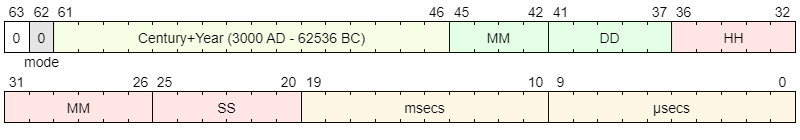
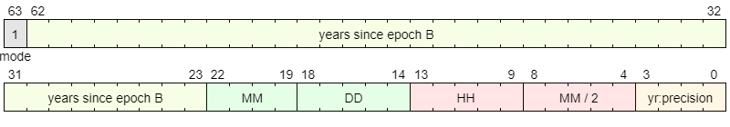
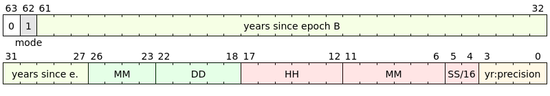
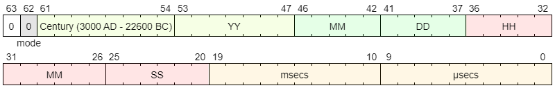
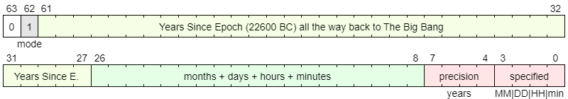
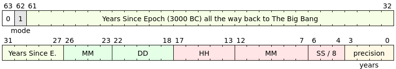
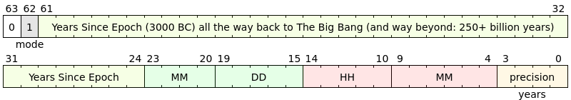

# Storing a wide range of date- & time-stamps of arbitrary precision in a 64-bit number

## The Problem

We want to store dates and timestamps in a single 64-bit integer value, where:
- the date range is expected to cover the entire period where humans have been *assumed* to produce written words, plus a few 1000 years *margin*, so anyone using the library system can store their dates without any fuss while we can quickly compare (and sort) these dates.
- dates are expected to lack some components, resulting in a "*rough estimate*". For example, a date may only list year and maybe the month, but not the day-of-the-month or any of the more detailing parts (timestamp within the day: `HH:MM:SS`)
- we also expect to store *anomalies* where the *most significant parts* of a date/timestamps are missing, e.g. an event timestamp which specifies the time-within-the-day to the microsecond precise, but lacks the entire year-month-day chunk.

The overall goal is to be able to store "arbitrary dates and timestamps" in a single 64-bit integer number format, which is (largely) sortable **and** includes a mechanism to reproduce the stored *imprecise date/timestamp* in its original detail, i.e. the formatter MUST be able to reproduce the date "`January 2022`" when it had been specified like that before, while "`13 January 2022 @ 12:40`" and "`13 January 2022 @ 12:40.31.049352`" are other examples of the same requirement, but with different levels of *original precision*. Ditto for *anomalous precision dates* such as "`13 January @ 12:40`" where both the *year* and *seconds + microseconds* components are absent.


## The Solution: Pre-design Analysis

### Option A: Every component has its own bitset

Let's see if we can get away with a system where each component consumes $n$ bits in the 64-bit number:

The required date range implies we need to span a range [from about 6000 B.C.](http://www.newarchaeology.com/writing/) till today (2022 A.D.), which we stretch by the mentioned *margin of a few 1000 years*, say 10,000 BC to 2200 AD (or wider).

> While we don't see a pressing need to move the upper bound further into the future (even when we consider [SF novels](https://en.wikipedia.org/wiki/Foundation_series) written at imaginary dates: those can get pretty wild and are deemed of minimal interest w.r.t. the dates *mentioned in those novels*: the SF novel itself will be written sometime before or during our lifetime, after all.
> **_Iff_** we expand this date range further, it'll be into the past for history / archaeology has surprised us before and we'ld be better prepared if we can encode those surprises easily.

As 6000 BC to 2022 AD is already 8022 years, the next power-of-2 (8192) is deemed *too tight* and we thus intend to pick the next one: $2^{14} = 16384$ years.

Will it then be useful to have 0 AD encoded at a bit boundary?[^bias] 

[^bias]:  ... which shows my cultural bias when I was writing the draft / question. 😇

We won't accept ±8192 years anyway (way too much range lost to fantastical future dates), so we'll have an offset in the value when encoding/decoding anyway. Bit-shifting is not faster than simple addition or subtraction, so we can pick the upper bound and derive all years from that one instead: at an upper bound of 3000 AD the 14-bit unsigned number can then be used as a simple negative offset for the encoded year.

12 Months encode in a 4-bit range: $2^4 = 16$, while the maximum of 31 days per month encodes in 5 bits: $2^5 = 32$

24 Hours take another 5 bits, 60 minutes consume 6 bits $(2^6 = 64)$, ditto for the seconds and what's left is good for the milli- or microseconds, depending on how much will be left for those.

Summing the rough bit costs per component, we arrive at $14 + 4 + 5 + 5 + 6 + 6 + m = 64$ where $m$ is the number of bits still *potentially* available for the milli-/microseconds.  $\Longrightarrow m = 64 - (14 + 4 + 5 + 5 + 6 + 6) = 64 - 40 = 24$ which is *plenty* for the microseconds, as we won't be needing more than 20 since $2^{20} = 1,048,576$ -- we won't even need more when we split those up in *milliseconds* and sub-millisecond *microseconds*: those would take up 10 bits each, as $2^{10} = 1024$. 

This leaves us 4 bits surplus to play with; we can generously give away 1 bit when we specify the 64-bit number to be *always non-negative* itself, so we won't ever get into trouble due to *logical shift* vs. *arithmetic shift* CPU operations' intricacies where negative values are involved.

Meanwhile, the 3-4 surplus bits are not enough to encode the *presence* of each timestamp field as a single bit, e.g. *year-is-present*, *month-is-present*, and so on. Instead, we use 1 bit to encode a `mode` which we use to indicate which timestamp format is used (while maintaining sortability of the numeric value) as we have some ideas about encoding *prehistoric dates* (see further below), leaving a 2 bit surplus for our year+century.

Also, while a 64-bit (or 63-bit?) number formatted this way is very well *sortable*, calculating time deltas may be become a spot of bother as some work will be involved.

> Meanwhile we very *intentionally* skirted the issue of historic calendars and other such artifacts making life that bit more complicated when we work with historical dates before the international ISO date/time standardization. We assume that's a conversion driven by other attributes in the metadata.
> 
> We also completely disregard the *timezones*: as far as I am concerned any date and time should be UTC and *nothing else matters*; any timezone conversion should be driven by other means, e.g. geolocation or nationality attributes of the data at large, of which this timestamp will be a mere *particle*.

This results in this preliminary design (see further below for the "mode" bit: that's for going back all the way to the time of the birth of our universe: the Big Bang):

```wavedrom
{reg: [
  {bits: 10, name: "µsecs", type: 5},
  {bits: 10, name: "msecs", type: 5},

  {bits: 6, name: 'SS', type: 2},
  {bits: 6, name: 'MM', type: 2},
  {bits: 5, name: 'HH', type: 2},
  
  {bits: 5, name: 'DD', type: 6},
  {bits: 4, name: 'MM', type: 6},
  
  {bits: 16, name: "Century+Year (3000 AD - 62536 BC)", type: 3},
  {bits: 1, name: "0", attr: "mode", type: 1},
  {bits: 1, name: "0"},

], config: {hspace: "width", lanes: 2, bits: 64, vflip: false, hflip: false}}
```




### Coping with the fields that weren't specified in the input

*Not Specified* for any field in this timestamp number design would then require the use of *magic values*, where each field has an associated *magic value* (zero(0) or otherwise), which encodes the notion of "this field has not been specified".

For sorting purposes -- **assuming we sort from old (top) to new (bottom)** -- it is useful to have that magic value set to zero(0), so it always ends up at the (sub)top; alternatively we can choose to pick the *maximum value* as the magic number, resulting in "*under-specified*" dates ending in the (sub)bottom rows, preceded by all the dates which *do* have that field set to sane values.

> This assumes we are sorting from old to new. The order reverses when we sort from new to old, e.g. when we wish to see the latest publications *first*.
> 
> For most applications we observe the preferred sorting order for dates is new (top) to old (bottom) so choosing the  *maximum value* as *magic number* then would have these *under-specified* dates float to the (sub)top, grabbing some extra attention. Which is my preference and thus chosen as [our software's](https://github.com/GerHobbelt/libeternaltimestamp) approach.

Considering we can easily encode `month = 0` as a magic, but would be in serious trouble if we were to do the same for the time fields (e.g. `minute = 0`), it makes sense to -- if we want to be rigorous and keep the magic rules to an absolute minimum -- for every field, define the *maximum value* as the magical value signaling "*not specified*"; meanwhile we can still bicker about whether months (and days?) should start numbering at 1 or 0 without any harm to the month number layout: `month = 15` is an obvious magic value, but  `day = 31` is *not*. While none of the other fields suffer that way from this "*maximum is magic*" rule, the *day* field does, so here's where we have to be restrictive as we do not wish to expend another bit for this: you either pick ZERO(0) as your "this is not defined" marker value, *or* specify the "maximum field value" as that signal, in which case your regular date's days will be numbered 0..30.

> I don't like having a slew of exceptions-to-a-rule cluttering the design, so it makes perfect sense to code the *first day of the month* as *0* instead of *1*: after all, there's no real need for *days* to be treated exceptionally compared to hours (first hour of the day is hour *0*!), minutes, seconds, or anything. Okay, humans are used to having their months and days start at 1, but that's a *display* issue, not a technology requirement.
> 
> So day-of-month range 0..30 it is.
> First month of the year is month *0* and first day of the month is day *0*. Thus we have one consistent rule for all timestamp fields. 🥳


### Sortability vs. Continuity of the 64-bit number

Should we do anything about the other *invalid values*, e.g. `month = 14`, given that most of our fields can store more values then strictly necessary?

While this "*n* bits per field" layout perfectly allows us to encode any date or timestamp we crave, it is clearly *sortable* as the order of appearance of the bitfields within the number determines their sort priority, while our simple "*not specified* is encoded as the highest possible value of the field" rule allows a consistent and useful sort order for arbitrary dates and timestamps.
Date/time *differences*, i.e. "*time deltas*" or "*time spent*" has become a little harder to calculate: to do that we need to diff all the fields, do something extra for the *not specified fields* and construct a continuous time delta from those individual differences. That's several subtractions, multiplications and additions per round.


## Option B: Considering continuous *microseconds since epoch* number systems instead

Instead of the above (Option A), we might want to look at these, ubiquitous, date/timestamp numbering systems: we can achieve our goals by defining the 64-bit number as a bitfield signaling which date fields are *not* specified (which are then encoded as value zero(0)) and a *numeric part* which indicates the number of microseconds since epoch.

Given our preference to be able to go back in time as far as possible, we can fix our epoch at `1 January 3000 AD @ 00:00:00.000000` and have all numeric values represent the offset back in time from that epoch: that makes the numeric part an *unsigned* entity, which is always *subtracted* from the epoch to arrive at the indicated date/time.

### How many bits for the field specification signals?

We have these fields:

- (century)
- year
- month
- day
- hour
- minute
- second
- microsecond

That's 7 - 8 bits for the "*enable*" mask bits, which leaves $64 - 7 = 57$ bits for the epoch offset: $2^{57} = 144,115,188,075,855,872$, which will get us, assuming **366** days-per-year all the way through for this estimate, near $\frac { 2^{57} } { 366 \times 24 \times 3600 \times 1E6 } = \frac {144,115,188,075,855,872} {31622400 \times 1E6 } \approx 4557$ years into the past since *epoch*, which will be $3000 - 4557 = -1557$ i.e. 1557 BC. Which is *way too modern* as we want/need to be able to go back at least to 6000 BC, hence a *distance to epoch* of $6000 + 3000 = 9000$ years, rather than a mere 4500-or-thereabouts!


#### *Why* is our *fundamentally more compact* offset-to-epoch number design so dramatically less capable than our bitfield-based design?!

That's because we now usurp entire *bits* (7 of them; *8* when you like to encode *century* as a special kind of year -- which we didn't (yet) include in the bitfield-based design, so we'll ignore that century feature here as well -- instead of a few mere *magic values* that were sitting quietly in the *continuity gaps* already present in the bitfield design. Hence we drop the expressive range of the 64-bit value by $2^7 = 128$ which is about 2 decades (powers of 10) -- and quite *significant* when it comes to expressing *range*.


### Hotfixing the design by dropping the bitmask?

Can we then hotfix this design by dropping the bitfield, getting our $2^7 = 128$ range scale back? 

Of course, we *could* go and encode the magic values for *not specified fields* in the offset, but that would break our continuity and make for some pretty crazy diff calculus instead: first, we would then have to pull the continuous number apart into its separate fields, detect which of them have the *magic value* and then do all the remaining work, as described for Option A, to arrive at a true continuous *time difference value*. Slow and cumbersome.

We *could* also analyze the bitmask and observe:
- that any somewhat valid date/time has *at least one specified field* hence one of the bits will always be 1. Can we *compress* the bitfield then, as that's one bit of the 7 that's always useless; the problem being that it can be *any of the 7*?
- Generally dates and times lack specificity at the head or tail end, but only "crazy" timestamps lack fields in the middle of the set, e.g. "`13 January @ 12:00`" is a sane date (missing seconds+microseconds at the tail and year(+century) at the head; so is "`1200 BC`", which lacks all but the year, i.e. a long missing tail, while "`biblical teatime: 0 A.D. @ 15:00 hours`" is "*insane*" from this perspective: day and month are missing in the middle!

Hence it *could* be possible to encode every date as a "how much of the head and tail are you missing" code: of 7 fields, you can miss 6 at most (given our first observation), resulting in the following legal head+tail missing spec sets, where we specify the *length* of the missing heads and tails, 0 thus meaning "*nothing's missing on this side*":

- 0 + 0..6  (where `+` separates the head from the tail spec; this one can have up to (and including) 6 tail end fields *missing*)
- 1 + 0..5  (ditto, but now we have 1 field missing in the head, i.e. *year* is missing)
- 2 + 0..4
- 3 + 0..3
- 4 + 0..2
- 5 + 0..1
- 6 + 0      (a bit of an odd one as this says all but the sub-second microseconds part are missing from the timestamp -- which can happen for performance measurements, but otherwise... 🤔)

When we count these, we get the total number of legal head+tail specs: $7 + 6 + 5 + 4 + 3 + 2 + 1 = 28$, thus fitting in an `enum` occupying 5 bits ( ${2^5 = 32}$ ), giving us back 2 bits of offset range, expanding our offset range to $4557 \times 2^2 \approx 18229$ years into the past from epoch, i.e. $3000 - 18229 = -15229$, i.e. 15229 B.C. will then be the oldest date we can address using this *microseconds since epoch* system.

```wavedrom
{reg: [
  {bits: 5, name: 'gap enum (0..28)', type: 2},
  {bits: 57, name: "µsecs before epoch (3000 AD - 1557 BC)", type: 5},
  {bits: 1, name: "0", attr: "mode", type: 1},
  {bits: 1, name: "0"},

], config: {hspace: "width", lanes: 2, bits: 64, vflip: false, hflip: false}}
```


### Is it worth it?

Comparing our range with the Option A design, we seem to be able to get farther back, as Option A can only reach back to $3000 - 16384 = -13384$ i.e. 13384 BC.

*However*, *Option A* had given away its *negative value range* by ignoring $bit_{63}$: when we re-introduce that one, Option A can reach back much further: $3000 - 32768 = -29768$, i.e. 29768 B.C.: that's much farther back than 15229 B.C.! But we're not done there! Next to $bit_{63}$, there are still 2 unused *surplus bits* available, which would result in a year+century field *at extremum* of $14+2+1 = 17$ bits, resulting in the oldest representable year being $3000 - 2^{17} = -128072$, i.e. the 128<sup>th</sup> *millennium B.C.* as oldest addressable dates for the Option A format!

Meanwhile our *microseconds since epoch* does not freely give up *any* bits, so we cannot pull the same rabbit out of our hat for the latter scheme. Option A wins on this aspect hands down then, regrettably.

Both schemes are perfectly *sortable*, while only the latter *microseconds since epoch* is very low cost when it comes to calculating precise *time differences* as the latter does not store magic values nor does it have any 'value gaps' like the former.

All in all, it looks like a tie: when time differences are important and many in your application, then the *since epoch* scheme will be the preferred one, as a difference value will be two bit masking operations and a subtraction away, while Option A will take 7 subtractions and assorted multiplications and additions before you have your time distance value.

Meanwhile, when fast conversion to and from dates and times in various text formats is your prime business, then the bit-fields' based Option A will certainly be your preferred choice.


## Conclusion: Option A is the preferred design for Qiqqa

As Qiqqa and its metadata database are primarily geared towards *search* and *reporting*, where *relative age* may be an *calculated attribute* one may want to inspect, it's not ubiquitous, while producing legible dates and times for reports, citations, literature reference lists and other appendices is far more the intended *use case* for the date/time data stored in Qiqqa.

Hence it's opportune to pick the Option A design: it is *sortable* while it has all the date/time fields already nicely separated into individual fields, which can be simply and easily converted to legible data/time text format elements for use in reports, citations and the rest.


------------------

## Adding the *Century Feature*: impact analysis

Say we want to store *century* as a (sub)field of *year*, so we we can say things like "5th Century B.C." rather than "500 B.C.", what would be the impact on the bitfields-based Option A design in terms of *range*, etc.?

The current design reserves 16 bits for the year+century -- which can be expanded to 17 bits if we accept negative 64-bit numbers! -- giving us a range of 65000 .. 128000 years. Chopping that bitfield into two parts, we would have to give the *year* part 7 bits $(2^7 = 128)$, leaving 9 .. 10 bits for the century, i.e. $2^9 = 512$ .. $2^{10} = 1024$, shrinking our *at extremum* range from about 1280 centuries down to a *mere* 512 .. 1024 -- still *abundantly plenty* when we realize that the current oldest known written words are about *90* centuries old in our number design: 9000 years before *epoch*.

Thus, while we cannot easily encode [the date of creation for the human expression on Pseudodon shell DUB1006-fL](https://en.wikipedia.org/wiki/Pseudodon_shell_DUB1006-fL), which, worst case, clocks in at 540,000 [BP](https://www.artobatours.com/articles/archaeology/bp-bc-bce-ad-ce-cal-mean/) and lies therefore *far* outside our addressable range, which maxes out at around 50,000 BP .. 100,000 BP unless we include some semi-logarithmic scaling for our oldest dates or other trickery to allow for historic dates way further back.

Meanwhile, [the first (undisputed?) human work of art is already cleanly addressable given our current design, including the Century Feature, at 73,000 BP](https://en.wikipedia.org/wiki/Prehistoric_art) -- *iff* we decide to use the entire 64 bits available in our integer.


### Okay, geeking out here, but what if we want to encode *far older dates*?

Well, the easiest observation there is that any event before about 5000 BC does not come with a *time value* -- I picked 5000 BC for this as one can argue that some documented events from antiquity can be placed at some time within the day, e.g. the murder of Julius Caesar can be conjectured about. And then I *extrapolate* from that one: some documented events, possibly also some writing done itself, can be placed somewhere in a day, e.g. at night, afternoon or morning, and some sort of a *conjectured* partial timestamp may be constructed.

Meanwhile the benefit of having all this precision available may be minimal, but so is extending the date/timestamp into deep prehistory, so we're looking for any easy tweak that gives us a *metric ton of additional range* while keeping the 64-bit number *sortable* across the entire range.

### Another use for $bit_{63}$

Say we limit our more or less sane data/time range to the *non-negative value range* of the 64-bit number, hence we *exclude* $bit_{63}$ and thus our year+century bitfield can be, *in extremum*, $14+2 = 16$ bits. With the Century Feature, that would then divide up into 7 bits for the year and 9 bits for the century, giving us a range of $2^9 = 512$ centuries, i.e. all the way back to $3000 - 51200 = -48200$ i.e. 48200 BC. 

That's plenty to encode the first written word at ~ 8000 [BP](https://www.artobatours.com/articles/archaeology/bp-bc-bce-ad-ce-cal-mean/)  (~ 6000 [BC](https://www.artobatours.com/articles/archaeology/bp-bc-bce-ad-ce-cal-mean/)), while earlier lasting human expressions must then use the "*extended range*" in our number: when we specify that *all negative 64-bit numbers* are the number of years [BP](https://www.artobatours.com/articles/archaeology/bp-bc-bce-ad-ce-cal-mean/), we easily encode [dates back to the creation of the universe!](https://www.ncbi.nlm.nih.gov/books/NBK230211/) As that would only cost about 40 bits or so, we have plenty left to do wicked things, like encode the *precision* of the given numbers in *number of significant decimal digits* in, say, 4 bits at the bottom, giving us 1..16 significant digits (expect a lot of those dates having a 1..2, maybe with luck 3, decimal digits of precision). 

> Mind you: that *precision* field MUST be placed at the Least Significant (low) side of the number to ensure we keep our *sortability criterion* intact, irrespective of the *precision* of each of the dates being sorted, so a bit of 64-bit bit shifting and masking will be in order then.

##### Why 40 bits?
 
Let's start with this quote from the NIH document: "*Over the past few decades, measurements of the Hubble expansion have led to estimated ages for the universe of between 7 billion and 20 billion years, with the most recent and best measurements within the range of 10 billion to 15 billion years.*"

Taking the worst-case, i.e. *oldest* date, we then need to encode "*20 billion years*", which takes $n$ bits: $n = \lceil log_{2}(20 \cdot 10^{9}) \rceil$ where  $log_{2}(20 \cdot 10^{9}) \approx 34.21928$, hence $n = \lceil log_{2}(20 \cdot 10^{9}) \rceil = \lceil 34.21928 \rceil = 35$, i.e. encoding *any* year back to the creation of the universe would cost, *at most*, 35 bits. 
*40 bits* is just a lazy round-up from that number.


----


Meanwhile we need to fix two issues that matter for the *sortability* of our date numbers:

- relatively young years now have 2 ways in which they can be encoded: in the Option A bitfield style, or as *prehistoric years* (negative / *mode=1* values) as described above: the obvious solution there is to forbid these dates to be written using the second system. Or offset the second by this (negligible) offset so that any negative number is automatically "in legal range".
- while these negative numbers have a direction where "more negative" means "older", the regular, positive value date values have the opposite direction: "more positive" means "larger negative offset since epoch" i.e. "older!"

One of these value ranges has to budge to ensure their direction is the same.

We therefor pick the *negative value range* and reconsider: that value range will only *implicitly add to the existing range* in a *sortable* fashion without the need for conditional logic everywhere, when we specify the 64-bit integer as being an **unsigned 64-bit number** instead.

Then we can simply specify that, once $bit_{63}$ has been set, the encoded *offset since epoch* still is "*years before epoch*" where the years can be calculated from this offset by subtracting the $2^{63}$ value first (and possibly the extra offset to account for the first bullet point above). Then, while already having taken care of those lower *precision bits* (see above), obviously, we get a number that's quite usable as *years before epoch* going all the way back to [the Dawn Of Time](https://www.ncbi.nlm.nih.gov/books/NBK230211/) ... and *beyond*.

```wavedrom
{reg: [
  {bits: 4, name: "yr:precision", type: 5},

  {bits: 3, name: 'SS / 8', type: 2},
  {bits: 6, name: 'MM', type: 2},
  {bits: 6, name: 'HH', type: 2},
  
  {bits: 5, name: 'DD', type: 6},
  {bits: 4, name: 'MM', type: 6},
  
  {bits: 4, name: "years since", type: 3},
  {bits: 31, name: "years since epoch B", type: 3},
  {bits: 1, name: "1", attr: "mode", type: 1},

], config: {hspace: "width", lanes: 2, bits: 64, vflip: false, hflip: false}}
```




and for 63-bit *always non-negative values* you get:

```wavedrom
{reg: [
  {bits: 4, name: "yr:precision", type: 5},

  {bits: 2, name: 'SS / 16', type: 2},
  {bits: 6, name: 'MM', type: 2},
  {bits: 6, name: 'HH', type: 2},
  
  {bits: 5, name: 'DD', type: 6},
  {bits: 4, name: 'MM', type: 6},
  
  {bits: 5, name: "years since e.", type: 3},
  {bits: 30, name: "years since epoch B", type: 3},
  {bits: 1, name: "1", attr: "mode", type: 1},
  {bits: 1, name: "0"},

], config: {hspace: "width", lanes: 2, bits: 64, vflip: false, hflip: false}}
```




#### Why are we so keen on "63-bit *always non-negative* numbers?

While programming languages such as C++ have no trouble coping with *signed* and *unsigned* integers both, database systems and other tools are usually not that flexible: (SQLite) SQL, which is an important language within the Qiqqa realm, does not have a way to specify the SQL equivalent of `uint64_t`: [all it knows is `INTEGER`, which is, always, *signed*.](https://www.sqlite.org/datatype3.html) 

> Some SQL database engines *may* support `UNSIGNED BIGINT` or similar `NUMERIC(20)` (e.g. [SQL Server](https://stackoverflow.com/questions/6125637/user-defined-type-for-unsigned-64-bit-value-vs-numeric20-0), [MySQL](https://blog.devart.com/mysql-int-data-type.html#signed_vs_unsigned)) but it is usually quite bothersome (e.g. [Oracle](https://stackoverflow.com/questions/12535202/best-way-to-store-an-unsigned-64-bit-integer-in-oracle-database-11g-using-occi)) and tricky to process correctly when you, like me, expect *other parties* to interface with your database store without the use of dedicated C/C++ code.

Next to that, we've been looking at Full Text Search Databases, such as [SOLR](https://solr.apache.org/) and [ManticoreSearch](https://manticoresearch.com/), where the latter has peaked our interest, but only very recently introduced *unsigned 64-bit integer* indexes/numeric columns. We wish to stay on the safe / conservative side and wish to be able to *switch* such systems some time in the future *iff the need arises*, so we'd rather stick with *the more restricted signed integer value range*, hence *63-bits*.


##### Why don't we get bothered by [JavaScript's 53-bit integer value limit](https://developer.mozilla.org/en-US/docs/Web/JavaScript/Reference/Global_Objects/Number/MAX_SAFE_INTEGER) then?

While [JavaScript has a known 53-bit `MAX_SAFE_INTEGER` range](https://developer.mozilla.org/en-US/docs/Web/JavaScript/Reference/Global_Objects/Number/MAX_SAFE_INTEGER) *and we know* that JavaScript will play a significant role in upcoming Qiqqa rebuild/development, we already (implicitly) decided to take that restriction into account when designing our timestamp format: when transported into JavaScript, our timestamp can be represented by a string or floating point value, depending on the actual requirements.

Meanwhile we could store our timestamps in a JavaScript floating point value (equivalent to a C 64-bit IEEE754 `double`) where the floating point precision would generally be sufficient to encode relatively recent dates at microsecond resolution, while resolution would degrade for dates reaching back into antiquity, but more importantly we would loose our ability to encode *partial timestamps*, i.e. timestamps where one or more parts are missing/unknown.

Our *eternal_timestamp* format is designed to encode both fully specified / known timestamps and *partial* timestamps in such a manner that this knowledge is kept intact.


##### And what about SQLite's `REAL`-based timestamps, encoding ["*Julian day numbers, the number of days since noon in Greenwich on November 24, 4714 B.C. according to the proleptic Gregorian calendar*"](https://www.sqlite.org/datatype3.html#date_and_time_datatype)?

While interesting and useful, this format does not permit storing *partial dates*, contrasting our format which does, in the same bits' size: `REAL` is the same size as a 64-bit integer.

Given that `REAL` is a [IEEE754 `double` having a 53-bit mantissa](https://en.wikipedia.org/wiki/Double-precision_floating-point_format) (that's why JavaScript has a 53-bit `MAX_SAFE_INTEGER`, incidentally), the same arguments as for JavaScript apply:

> \[...\] We could store our timestamps in a `REAL` (equivalent to a C/C++ 64-bit IEEE754 `double`) where the floating point precision is generally expected to be sufficient to encode relatively recent dates at millisecond or even microsecond resolution, while resolution would degrade for dates reaching back into antiquity, but more importantly we would loose our ability to encode *partial timestamps*, i.e. timestamps where one or more parts are missing/unknown.
>
> Our *eternal_timestamp* format is designed to encode both fully specified / known timestamps and partial timestamps in such a manner that this knowledge is kept intact.

Another argument *against* using `REAL` or any *floating point* equivalent is this:

*eternal_timestamp* is designed (Option A design) to store each part of the date/time-stamp individually. This ensures no conversion/extraction bugs can occur when such data/timestamps are extracted and printed from the store as-is since we are not converting back & forth from a *time delta* value that has to strictly adhere to some (proleptic) date format to ensure recoverability. 

> **Note**: it might be *handy* to store a *calendar identifier* next to our timestamp, so as to unambiguously specify which calendar was used when the given timestamp was entered. This is useful when you consider registering timestamps for events that are otherwise ambiguous. See also [bissextus](https://en.wikipedia.org/wiki/Bissextus), [OS vs. NS](https://en.wikipedia.org/wiki/Dual_dating), [UT1 vs. UTC](https://en.wikipedia.org/wiki/Universal_Time), [Julian Date](https://en.wikipedia.org/wiki/Julian_day) vs. [Julian calendar](https://en.wikipedia.org/wiki/Julian_calendar), [HJD](https://en.wikipedia.org/wiki/Heliocentric_Julian_Day) vs. [JD](https://en.wikipedia.org/wiki/Julian_day) / [OD](https://en.wikipedia.org/wiki/Ordinal_date), [leap second issues in computing](Issues_created_by_insertion_(or_removal)_of_leap_seconds), ...
> Ergo: when used for recording historical date/timestamps with intended high accuracy, it may be handy to provide conversion routines between the various scientific and historical calendars, using our timestamp layout as the starting point.

Surely we could have defined our timestamps to conform to a [(SQLite) *proleptic Gregorian calendar*](https://www.sqlite.org/lang_datefunc.html) or JDN/MJD astronomical [*proleptic Julian calendar*](https://en.wikipedia.org/wiki/Julian_day), just to name another ubiquitous, modern, example, but we'ld have all kinds of subtle issues for the sake of being able to produce *precise distances in time*: our format can easily handle [*leap seconds*](https://en.wikipedia.org/wiki/Leap_second):  seconds occupy 6 bits, where value 63 is the *magic value*, hence we have room for 3 *leap seconds all at once*: 1 leap second would give a value of 60, while 3 leap seconds would produce a (legal) value of 63. Meanwhile our 63-bit timestamp format is still *sortable* like any regular computer integer (the less-than, equal-to and greater-than operators will work as expected). 
Our timestamp format is more focused on accurately registering dates/times and rather less concerned about the *immediate availability* of any time *difference*. Which has been the main driver for those other floating point timestamp formats, particularly the [astronomical JD / MJD / etc. formats](https://en.wikipedia.org/wiki/Julian_day).


#### Sortability & *steadily increasing numeric values for increasingly older date/timestamps?
 
Analysis:
- Re sortability: we *do* have a "*steadily increasing*" numeric value for increasingly older date/timestamps up to at least the "boundary value" where $bit_{63}$ flips, since all values with $bit_{63}$ *unset*, i.e. zero(0), are positive integer values counting down from epoch, where the *field order* determines the significance of the various date/timestamp parts in the overall numeric value. While this numeric range may therefor not be theoretically [*continuous*](https://www.math.net/continuous), sorting isn't bothered by *discontinuities* as long as the numeric value is **steadily increasing**.
- At the boundary (where $bit_{63}$ is flipped from zero(0) to one(1)), the earlier thought/definition said the **unsigned numeric value** would be **steadily increasing**: all dates with $bit_{63} = 1$ are older than any of the dates with $bit_{63} = 0$ by definition: when this is not true, we have a date format *conversion bug* that needs to be fixed.
- Beyond the boundary, the **unsigned numeric value** of the numbers steadily increases as the dates get older: that's why we must, at date conversion, subtract our "delta from epoch" from MAX_INT when the conversion calculation finds the given date is old enough to land in the $bit_{63} = 1$ value zone. Given that our *precision bits* are positioned at the LSBs (Least Significant Bits), they won't alter the notion of **steadily increasing** numeric value: any *less precise* yet *earlier* date will have a lower unsigned numeric value than any *precise* (or imprecise) yet *older* date, thus keeping the criterion for sortability intact and simple: hence $bit_{63}$ decides between two *different date conversion processes* when transforming these 64-bit integer numbers to & from human-readable date/timestamps, yet *any* encoded 64-bit numeric timestamp can thus safely be compared to any other 64-bit unsigned integer timestamp value for quickly deciding on their *sorting order*: the entire value range is *steadily increasing* (away from epoch into antiquity and beyond).


### What if we don't want to be bothered by *unsigned* vs. *signed* 64 bit value?

If we worry about that, for it can be a spot of bother when using multiple programming & scripting languages, we can pull off the same trick at $bit_{62}$ instead, leaving $bit_{63}$ untouched.

Let's see what that'll do to our century range, etc...

The *century field* will then only be $16 - 7 = 9$ bits: 16 bits base design, while a surplus bit $(bit_{62})$ will serve as *format switch signal* (a.k.a. `mode`) and leaving $bit_{63}$ well alone. Anyway, this means you can go back to $2^9 = 512$, i.e. $3000 - 51200 = -48200$, i.e. 48200 BC. Plenty range for *the written word*, even when we get a surprise find some day -- unless it's of *history rewriting* power. But then that's where our "*extended date range*" will serve!

Now set $bit_{62}$ (a.k.a. `mode`), extract the 4 *precision bits* at $bit_{0..3}$, and we're left with a $61 - 4 = 57$ bit value representing the *years before epoch*.  As the estimated date range till Big Bang is well within 39 bits (35 bits for the *year* plus 4 for the *precision*), this number still has plenty room for some insane precision, e.g. seasons, months or days.

> Let's have a look at the possible resolution then, for curiosity's sake:
>
> When we take [the Big Bang estimate, i.e. the age of the universe](https://www.ncbi.nlm.nih.gov/books/NBK230211/) worst-case value at 20 billion years BP, then we'd need $\lceil log_2( 20 \text{ billion} ) \rceil = \lceil log_2( 20 * 10^9 ) \rceil = 35$ bits.
> Assuming our worst-case design, i.e. using $bit_{62}$ instead of $bit_{63}$, that still would leave us $62 - 35 - 4_{\text{precision bits}} = 23$ bits for the within-the-year stuff. Which we can do either as a set of bit-fields or as a continuous numeric range. In the latter case, we'd want to encode *presence-or-absence* for each date/time part as we have for the other range, and since we don't have "magic values" when we don't have bit-fields, that's going to cost a couple of extra bits.
> But before we do that, let's see what the maximum is we can squeeze into those 23 bits:
> $2^{23} / ( 366 \times 24 \times 60 ) \approx 15.9$, meaning we have (more than) 3 bits left which represent *seconds*, i.e. we can encode to within a single *minute* of time without a fuss!
> Now we introduce those extra *presence-or-absence* bits alongside with that, resulting in a slightly lower resolution: assuming we signal *month*, *day*, *hour* and *minute*, that's 4 bits less, giving us $2^{19} / ( 366 \times 24 \times 60 ) \approx 0.9948$, i.e. we'd still be able to encode the date/timestamp to (almost) within the *minute* precise. All the way to the Big Bang. Now that's an *insane range & accuracy*.
> 
> I *like* it!  😈


Here's the layout for regular date/timestamps, using only *63* bits, i.e. this is the layout when we decide to leave $bit_{63}$ *untouched* entirely, hence *no worries about unsigned vs. signed integer misbehaviour* when mixing various programming languages and/or storage systems (including [SQLite `rowid`](https://sqlite.org/lang_createtable.html#rowid)):

```wavedrom 
{reg: [
  {bits: 10, name: "µsecs", type: 5},
  {bits: 10, name: "msecs", type: 5},

  {bits: 6, name: 'SS', type: 2},
  {bits: 6, name: 'MM', type: 2},
  {bits: 5, name: 'HH', type: 2},
  
  {bits: 5, name: 'DD', type: 6},
  {bits: 4, name: 'MM', type: 6},
  {bits: 7, name: 'YY', type: 3},

  {bits: 9, name: "Century (3000 AD - 48200 BC)", type: 3},
  {bits: 1, name: "0", attr: "mode", type: 1},
  {bits: 1, name: "0"},

], config: {hspace: "width", lanes: 2, bits: 64, vflip: false, hflip: false}}
```




and here's the second layout, the one for the *prehistoric times*, as discussed above:

```wavedrom
{reg: [
  {bits: 4, name: 'specified', attr: "MM|DD|HH|min", type: 2},
  {bits: 4, name: 'precision', attr: "years", type: 2},
  
  {bits: 19, name: 'months + days + hours + minutes', type: 6},

  {bits: 5, name: "Years Since E.", type: 3},
  {bits: 30, name: "Years Since Epoch (48200 BC) all the way back to The Big Bang", type: 3},
  {bits: 1, name: "1", attr: "mode", type: 1},
  {bits: 1, name: "0"},

], config: {hspace: "width", lanes: 2, bits: 64, vflip: false, hflip: false}}
```




> **Aside**: anyone checking the `wavedrom` sources: the latter has the 35-bit "Years since Big Bang" split into two fields for display purposes as we instructed `wavedrom` to render this layout in 2 *lanes*.

Both these together span the entire *positive numeric range* of a 64-bit integer and **does not** require the use of negative values. 

However, at conversion to/from human readable structure/format, the second layout uses a different 'epoch' than the first (as discussed before), **but there's a catch**:
- for the original 64-bit spanning layout, where `mode` would be $bit_{63}$, we'ld have the 'epoch' chosen to be the worst-case estimate of the Big Bang (give or take a few years), so the number, while *negative in a signed integer*, would still be **steadily increasing** when considered as an *unsigned integer*.
- However, our *63-bit wide layout* does not suffer from that problem, hence no need to invert that offset now: zero(0) in "*Years since Big Bang*" would simply mean *epoch*, i.e. our chosen epoch at 3000 AD. 

  To simplify matters we keep using the same epoch (which keeps the amount of conversion calculus work to a minimum) and **by definition** we declare all timestamps *younger than what can be stored in the first format* to be **illegal** when they occur in this layout form.

> In other words: any date/time converter must first try to encode the given date/time in the first format, **and only when the `Century` field does not suffice there**, encode the given date/time in the second format.

Incidentally, this guarantees that any given date/time **is guaranteed to be uniquely represented in the encoded format**: for every date/time, there is only *one* legal bit representation.
 
Which is a great boon for equality tests, etc.!


P.S.: here's the "prehistoric dates", i.e. the second layout, once again, but now done as fields, like we did in the primary layout, instead of those "is this part specified" bits occupying 4 bits in the layout:

```wavedrom
{reg: [
  {bits: 4, name: 'precision', attr: "years", type: 5},

  {bits: 3, name: 'SS / 8', type: 2},
  {bits: 6, name: 'MM', type: 2},
  {bits: 5, name: 'HH', type: 2},
  
  {bits: 5, name: 'DD', type: 6},
  {bits: 4, name: 'MM', type: 6},
  
  {bits: 5, name: "Years Since E.", type: 3},
  {bits: 30, name: "Years Since Epoch (3000 BC) all the way back to The Big Bang", type: 3},
  {bits: 1, name: "1", attr: "mode", type: 1},
  {bits: 1, name: "0"},

], config: {hspace: "width", lanes: 2, bits: 64, vflip: false, hflip: false}}
```




Notice how we now, *again*, have way more precision available as we can specify the time down to 1 minute intervals? Meanwhile we discard the seconds fragment, so there's also plenty surplus range to the "years since epoch" so someone can still use this number [while arguing that the Universe is much older than we even thought](https://scienceblogs.com/interactions/2007/09/27/answering-objections-to-the-bi), as it allows us to go back billions of years before the current worst-case estimates of The Big Bang:

```wavedrom
{reg: [
  {bits: 4, name: 'precision', attr: "years", type: 5},

  {bits: 6, name: 'MM', type: 2},
  {bits: 5, name: 'HH', type: 2},
  
  {bits: 5, name: 'DD', type: 6},
  {bits: 4, name: 'MM', type: 6},
  
  {bits: 8, name: "Years Since Epoch", type: 3},
  {bits: 30, name: "Years Since Epoch (3000 BC) all the way back to The Big Bang (and way beyond: 250+ billion years)", type: 3},
  {bits: 1, name: "1", attr: "mode", type: 1},
  {bits: 1, name: "0"},

], config: {hspace: "width", lanes: 2, bits: 64, vflip: false, hflip: false}}
```



---

## Software

[libeternaltimestamp](https://github.com/GerHobbelt/libeternaltimestamp) is a small library based on these ideas.
