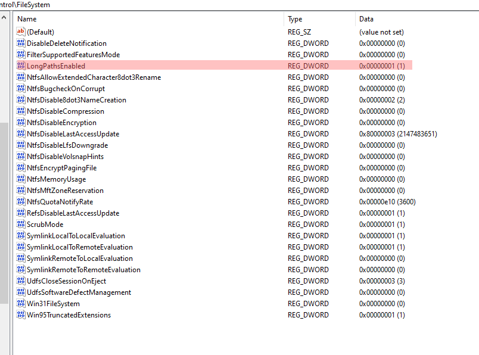

# MSVC error MSB3491: The fully qualified file name must be less than 260 characters

Note: the *Windows Registry* edit + `gpedit`  edit mentioned below are what made it work for me long time ago already.

-- Ger Hobbelt


## Answer No. 1

From: https://www.microfocus.com/documentation/filr/filr-4/filr-desktop/t47bx2ogpfz7.html

### Enabling Windows Long Path (Windows 10 - 1803 build)

On performing the following procedure, power shell will work for the *Long Path* feature:

1.  Click Window key and type `gpedit.msc`, then press the *Enter* key. This launches the *Local Group Policy Editor*.
    
2.  Navigate to *Local Computer Policy > Computer Configuration > Administrative Templates > System > Filesystem*.
    
3.  Double click *Enable NTFS long paths*.
    
    
        
4.  Select *Enabled*, then click *OK*.


---

## Answer No. 2

From: https://stackoverflow.com/questions/11434206/visual-studio-unknown-build-error-the-fully-qualified-name-must-be-less-than-26, heavily redacted to remove noise:

### [Response 1](https://stackoverflow.com/posts/43106223/timeline):

I had a similar issue where the compiler reported that there was a problem with the file ASPNETCOMPILER. The actual issue was that the solution contained a `node_modules` folder, and this folder can contain very lengthy paths, and it looks like the compiler can't handle this.

Windows 8.1 and 10 have an option to increase the Win32 path limit:

-   Open *Group Policy Editor* (Press **Windows+R** and type `gpedit.msc` and hit *Enter*)
-   From the *Group Policy Editor* window, navigate to the following node: `Local Computer Policy\Computer Configuration\Administrative Templates\System\Filesystem`
-   Double-click on *Enable Win32 long paths* option and enable it.

See here for additional reference - [https://www.microfocus.com/documentation/filr/filr-4/filr-desktop/t47bx2ogpfz7.html](https://www.microfocus.com/documentation/filr/filr-4/filr-desktop/t47bx2ogpfz7.html)

-- answered Mar 30, 2017 by [Chris Halcrow](https://stackoverflow.com/users/1549918/chris-halcrow)

Notes:

- Yes, it isn't a filepath. Open group policy editor as I've described in the first bullet point, and it'll provide a folder structure that you can navigate (it doesn't match the Windows folder structure). I'll change my answer to make this clear. 
   
   – [Chris Halcrow](https://stackoverflow.com/users/1549918/chris-halcrow)
   
* `gpedit` is only available on Windows 10 Professional and Enterprise. ~~And besides that it appears that neither version of Visual Studio 2019 (Community, Professional, Enterprise) are actually supporting long paths even though you enable it in Windows...~~
    
    – [Pieterjan](https://stackoverflow.com/users/8941307/pieterjan)


### [Response 2](https://stackoverflow.com/posts/63584992/timeline):

There is registry approach which can be used at least for Windows 10:  
Value of the parameter `HKLM\SYSTEM\CurrentControlSet\Control\FileSystem LongPathsEnabled (Type: REG_DWORD)` should be set to 1. 

[](https://i.stack.imgur.com/MwEfU.png)

You don't even need to restart anything (IDE or PC).

Notes:

* Group Policy is enforced over any registry changes. So if a user's policy has it disabled, it won't matter if you reboot or not as GPO policy gets enforced at boot-up. 
   
   – Oct 13, 2022, [RashadRivera](https://stackoverflow.com/users/1154363/rashadrivera) 


### [Response 3](https://stackoverflow.com/posts/68662359/timeline):

This problem is caused by the restriction of Windows OS about handling long path greater than length 260. The solution of this problem for VS2019 is pretty straight-forward. But, for VS2017 users, we can use a workaround to solve the problem.

**VS 2019**

-   Open `run` window (windows-key + r), then type `regedit` and hit enter.
-   On the address bar of Registry Editor, enter this: `HKLM\SYSTEM\CurrentControlSet\Control\FileSystem`
-   On the right side, find the key `LongPathsEnabled`, double click on it, and change the value from `0` to `1`
-   Restart VS2019, clean (if needed) and build your project again. The error should be fixed.

**General workaround (VS2017/VS2019)**

We can create a link of the original longer path to a shorter one. Then, VS will treat the shorter path as project root and the issue will be solved.

-   Create a shorter root path for project, e.g. we have created `"D:\project"` directory
-   Now open `cmd` (Command Prompt) and Create a symbolic link using this command: `mklink /D "D:\project\myProject" "YOUR_ACTUAL_LONG_PATH_PROJECT_ROOT_DIRECTORY"` _[You may need to open cmd as administrator if above command fails to execute]_
-   Now, open VS project from the `"D:\project\myProject"` directory and it should work.


### [Response 4](https://stackoverflow.com/posts/71778303/timeline):

For this, you have to run Power Shell on Windows as an administrator, and then type:

```
New-ItemProperty -Path "HKLM:\SYSTEM\CurrentControlSet\Control\FileSystem" -Name "LongPathsEnabled" -Value 1 -PropertyType DWORD -Force
```

-- Apr 9, 2022, [Jeremy Caney](https://stackoverflow.com/users/3025856/jeremy-caney)

Notes:

* Users must be aware of GPO enforcement. If your PC has the "Enable Win32 long paths" set to "Disabled", then your registry change will be overwritten at reboot or the next cycle of GPO enforcement. 
  
   – Oct 13, 2022, [RashadRivera](https://stackoverflow.com/users/1154363/rashadrivera)
  
