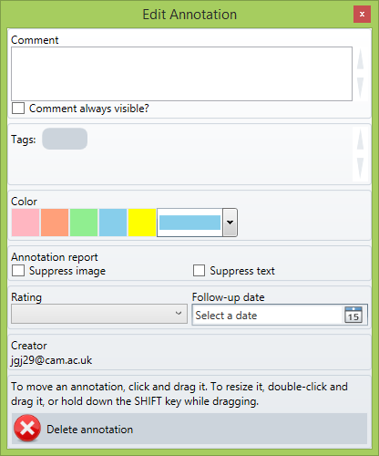

#       The Qiqqa Manual       

### V.20160720

---------------------------------------------------------------------------------

# Table of Contents

[[toc]]

# Table of Contents v2

<TOC />

# 1. Welcome to Qiqqa!

Thank you for downloading and installing Qiqqa. We're delighted to have you on board!

What is Qiqqa?

Qiqqa is an invaluable tool for anybody working with **many documents** and **big ideas**. We hope it will help with most aspects of your academic or corporate research: searching, finding, reading, commenting, highlighting, annotating, tagging, cross-referencing, exploring, discovering, brainstorming, sharing, writing bibliographies, synchronising your libraries everywhere, archiving, reporting, remembering. Phew!

Qiqqa will always be a work in progress: we're continuously shaping it to be the world's best research tool. We receive emails daily from delighted users, and we want it to truly meet your needs. So please submit feedback whenever you like! Bugs, ideas, complaints or praise, it's all very welcome. Let us know what you need, or which features you're enjoying.

This manual sets out to describe the most fundamental aspects of Qiqqa. But it is by no means complete! Don’t be shy to explore the nooks and crannies of what Qiqqa offers. By hovering your mouse cursor over any of the toolbar buttons, you will get a description of what that button does. There is also a Qiqqa forum where we encourage you to post your questions so that other members of the Qiqqa Community can pitch in and help you out. And once you become more experienced with Qiqqa, please feel free to jump in and help others out.

Most importantly, have fun! Research is an amazing process, and Qiqqa strives to take the “search” out of research so you can focus more on the exciting information at your fingertips.

# 2. Your Qiqqa Account

You can use Qiqqa Desktop without creating an account by pressing ESCAPE or by pressing the “Guest” button at the bottom of the Qiqqa Desktop Login screen. You will then be able to use Qiqqa with a single Guest library.

To access some of the features of Qiqqa, such as having multiple Web Libraries, syncing with the cloud and Premium and Premium+ memberships, you will need a Qiqqa account.

## Creating a Qiqqa Account

To create a new Qiqqa account, press the “Register” button on the Qiqqa Desktop Login screen, or go to [http://www.qiqqa.com/Account/Register](http://www.qiqqa.com/Account/Register).

Once you have chosen your username and password, use can use these same login details on the Qiqqa Website, Qiqqa Desktop and Qiqqa for Android.

## Logging in and out of Qiqqa Desktop

Enter your username and password on the Qiqqa Desktop login screen. You will then be logged into Qiqqa.

To logout of Qiqqa Desktop, press the “Logout” button on the status bar in the bottom-left corner of the screen.

## Logging in and out of the Qiqqa Website

To log in to the Qiqqa Website, go to [http://www.qiqqa.com/Account/LogOn](http://www.qiqqa.com/Account/LogOn)

Be sure to enter the Qiqqa username you chose when you registered, and not your email address.

To logout, press the “Logout” link in the top-right corner of the Qiqqa Website.

# 3. The Start Screen

The Start screen is your entry point to Qiqqa.

Before we get going though, the first thing to understand is that the first few times you run Qiqqa, it starts in Novice mode. Novice mode is designed to gently introduce you to the power of all of Qiqqa features and exposes only the subset of the features of Qiqqa that are most necessary to a newcomer. This manual though has to cover all the features of Qiqqa, so the first thing we will do it put Qiqqa into Expert mode by clicking the ExpertMode button on the toolbar. You will need to restart Qiqqa to get all the features. Later – if you want to go back to Novice mode, you can do it from the Tools/Settings menu.

Once you are in Expert mode, it should look like this:

From the Start Screen toolbar you can access the main features of Qiqqa:

* Opening and managing your various PDF libraries.

* Running Qiqqa InCite to add citations and bibliographies to Word documents.

* Using Qiqqa Expedition to browse the themes present in your PDF documents.

* Building dynamic and interactive Brainstorms to explore your PDFs.

* Power-browsing the web to quickly add PDFs to your libraries.

* Accessing the configuration screen and help.

To locate each of these features, move your mouse over each button on the toolbar at the top of the screen and rest it there (“hover it”) to get a popup explaining what each button does.

The Start screen is dominated by your most recently opened PDF library. Several PDFs are recommended from that library for reading next. Double-click on one of them to quickly get down to some reading. These PDFs include in descending order of priority:

* Papers that you have marked “Top Priority” in the Reading Stage

* Papers that you have marked “Interrupted” in the Reading Stage

* The most recently added PDFs that are still marked as Unread.

Next to each library are three toggle buttons:

* The first toggles whether you want this library to automatically sync with its Web Library in the cloud.

* The second opens some statistics about your activity in the library.

* The third opens the recommended PDFs for any of your other libraries.

On the right hand side you have access to some information about Qiqqa – most importantly the “Videos and Help” section, but also information about Qiqqa Premium, Premium+ and the Qiqqa Champion Project. Please the “+” button to expand the sections. Note that you can click the “splitter bar” to resize or collapse the region on the right. This splitter bar functionality is available in many places in Qiqqa.

The status bar at the bottom gives you several items of information:

* Your current Qiqqa Premium and Premium+ membership status

* The current version of Qiqqa – if followed by an “s” you are using the “setup.exe” version of Qiqqa (recommended, and suitable for people who have administrator rights on their machine) and if followed by an “o” you are using the web download version (for those who have a locked down machine).

* The username with which you have logged into Qiqqa, and with which all syncing will be done online.

* Various status updates about background tasks that are going on inside Qiqqa.

# 4. The Library Screen

The Library screen is where you get to collect and organise your PDFs. The easiest way to get to this screen is to click on the title of the library on the Start screen.

## The PDFs in the library

Exhibit 1 lists all the PDFs that are currently in this library. The fastest way to add more PDFs to your library is to drag-and-drop them in from Windows Explorer. However, there are loads of ways do can do it, such as:

* You can import PDFs from other reference managers, like EndNote, Zotero and Mendeley. This is accessible under the first menu item.

* You can browse to a PDF using the Qiqqa Power Browser. The PDF will automatically be downloaded into your Guest library and you will be given the opportunity to move it to another library.

* You can set up a watch folder (again under the first menu item). To start watching a folder, choose the watch folder option, select a folder and press OK. To stop watching a folder, choose the watch folder option, and then press CANCEL. Each library can only watch one folder.

Clicking on one of the PDFs brings up some details about that PDF in Exhibit 2, where you can quickly review or modify any annotations you may have made about your PDF. You can also manually edit the metadata associated with the PDF, such as its title, authors, and other bibliographic information, but see Section 8 for quicker ways to do this.

The list of PDFs is affected either by filters you have in place (Exhibit 3) or by how you have sorted them (Exhibit 4). You can select multiple PDFs in several ways:

* Checking the square box below each PDF adds/removes the PDF from the current selection.

* Holding down CTRL and clicking individual PDFs adds/removes them PDF from the current selection.

* Holding down SHIRT and clicking a PDF adds to the current selection all the PDFs between the last selected PDF and the clicked PDF.

* Pressing CTRL-A selects all the PDFs in the current list.

Once you have selected one or more PDFs you can right click any PDF to get a variety of functions that affect only the selected PDFs. Several of the tools on the toolbar also only apply to the currently selected PDFs.

## Filtering the library

Exhibit 3 shows the various filters that you can apply to the library. Probably the most important filter is the Tag filter. You can add multiple tags to your PDFs in Exhibit 2 by typing each tag into the grey box in the Tags section and pressing ENTER. To quickly add multiple tags, separate them with a semicolon.

Once you have added tags to your library, Qiqqa offers a powerful way of filtering by them. Let’s try to explain the power by way of example. Suppose your research PDFs document animal in various habitats. Perhaps each PDF can have associated with tags for each of the animals and countries it covers. Then you can do several types of tag filtering:

* Simple filtering involves selecting a single tag, and only the PDFs with that tag will be shown.

* Hierarchical filtering involves first selecting a single tag, and then selecting another tag in the tree that appears beside the tag. By clicking the tag “Madagascar” you get all the PDFs relevant to Madagascar, and the tree of tags that appears beside “Madagascar” will show all tags that exist in PDFs with the tag Madagascar – both the animals in Madagascar, and the countries that are covered in common with Madagascar. Selecting the subtag “Lemur” will then only show the papers that are about Madagascar and Lemurs. This is similar to having folders within folders on your hard drive, but is fantastically more powerful because you can do the query “in reverse”. You can first filter by all papers that talk about Lemurs and then drill into the countries that have Lemurs! Try that on your folder of PDFs…

* If you want to drill even more specifically, you need to use the circular “AND” and “OR” radio buttons. By selecting multiple tags at the same level in the tag hierarchy, you can either show only those papers that have “tag1 AND tag2 AND tag3” (i.e. their intersection) or those papers that have “tag1 OR tag2 OR tag3” (i.e. their union).

* If you check the NOT checkbox, you will get the inverse of your PDFs. So if you select multiple tags, NOT is checked, and the AND radio box is selected, you will get all papers that do not have all those tags. IF OR is selected, you will get all papers that do not have any of those tags.

* Phew! It sounds harder than it really is. Start with the simple filters and it will become obvious over time. Feel free to play with these filters – you can’t break anything! J

In addition to being able to filter by tags, there are a multitude of other filters inside Qiqqa:

* **AutoTags** – These are a powerful mechanism for automatically tagging your PDFs. They rely very heavily on your having properly populated the titles of your PDFs to find reliable suggestions for AutoTags. But a little effort up front will lead to rewards all over Qiqqa – from AutoTags to Expedition themes to brainstorming. Section 8 will explain how to quickly get these titles populated. The blacklist and whilelist allow you to help Qiqqa block the tags (blacklist) and find the tags (whitelist) that are particularly meaningful to you. Note though that the free version of Qiqqa is limited to five tags in each of these lists.

* **Author, Publication, Year** – These are automatically available once you have populated the metadata of your PDFs. See Section 8 for how to quickly obtain these.

* **Stage, Rating** – These are obtained from the “Review” area for each PDF (Exhibit 2).

* **Theme** – once you have generated reasonable AutoTags for your library, you can get Qiqqa to automatically detect the themes in your library using Qiqqa Expedition. The resulting themes are available as filters.

Note that you can apply multiple filters at once. This allows you to do such filtering as:

* Which were my “_favourite_” papers published within the “_past 3 years_”?

* Which papers in the “_antenatal care_” theme have I “_not yet read_”?

* Which are the papers by “_Jones_” in “_Nature_” that I have “_not_” tagged with “_fruit fly_” or “_gnat_”

## Sorting and searching

Clicking on any of the search options at Exhibit 4 sorts your library. Click them a second time to reverse the sort. Sorting by “SearchScore” is only relevant once you have searched your library using Exhibit 5. Type your Google-like search query into the Search Box and hit ENTER. A little score will pop up next to each PDF. Click on this search score to get Qiqqa to show you examples from the PDF where your search query has a literal match.

Be sure to press the question mark next to the Search Box to get an explanation of the full power of Qiqqa’s search. Note that some of these searches return approximate or fuzzy matches, so pressing the search score might not find any literal matches. Rest assured that the search score assigned to each PDF is quite a good indicator of its relevance.

## The toolbar

Finally, Exhibit 6 is the toolbar. You can access a variety of tools here. Probably the most interesting to get started with are the Sync and the Annotation report. Move your mouse over each button and rest it there (“hover it”) to get a popup explaining what each button does.

# 5. The PDF Reading Screen

The PDF Reading screen is where you will be spending most of your time in Qiqqa.

Exhibit 1 is the main PDF reading area where you interact with your PDFs. This is where you add annotations, highlight and ink notes as you progress with your reading.

Exhibit 2 is where you keep track of where you are with the current PDF. This is the same functionality down the right hand side of the Library screen.

* **Review** – Set the Reading Stage to reflect where you are with the PDF. Remember that setting the Reading Stage to “top priority” or “interrupted” will include the PDF on the Start screen as one of your next recommended readings. You can do with Rating and Favourite as you see fit.

* **Tags** – The Tags section is really important: associating documents with tags allows you to slice-and-dice your PDFs using the Tag Filter on the Library screen. Note that tags you associate with PDFs are different to tags you associate with Annotations (see Section 7). The former are used to filter PDFs in the Library screen. The latter are used to build tag-specific Annotation Reports.

* **Comments** – You can add arbitrary comments in the Comments box. These comments will show up on the Annotation Report described in Section 7.

* **Annotations** – The Annotations section summarises any Annotations you may have already made on this PDF. Sometimes, if you have made too many Annotations, for performance reasons, you might have to press a button to load the annotation summary.

* **Abstract (on the Preview tab)** – Qiqqa will try to automatically detect the abstract in the PDF and display it here. If you find that Qiqqa has got it wrong, you can edit the text in this box or paste in the real abstract. IF you want to go back to the “automatic version” just clear all the text in this box.

Exhibit 3 puts the PDF into perspective relative to your library:

* **Duplicates** – Any duplicate PDFs are shown if they exist. Click on a duplicate to open to see if you have already dealt with that PDF. Qiqqa looks for duplicates using an approximate match on the Title associated with each PDF, so for this to work well, you have to have populated your PDF metadata. It is impossible for two identical PDFs to be in a Qiqqa library, so the only possible duplicates are PDFs that might be preprints, or PDFs that have been edited in some way (e.g. using PDF editing software to add highlights or annotations).

* **Online Databases** – lets you quickly look up the current PDF in some of the more popular online databases.

* **Linked Docs** – allows you to arbitrarily link together two documents in your library so that you can jump between them quickly. When you create a link, it is a permanent two-way link.

* **Keywords** – Qiqqa lists keywords that have been automatically associated with this PDF. You have to have generated your AutoTags for this to be available. To regenerate your AutoTags, go to the Library screen, select the AutoTags filter, and press the “Regenerate AutoTags” button.

* **Themes** – The Themes present in this PDF are shown next. To get your Themes, you have to have run Qiqqa Expedition on your library. See Section 14 for how to do this.

* **Also by** – For each of the authors of this PDF, Qiqqa shows any papers with an author with a matching surname. We decided to go with just surnames because there is often ambiguity between full first names, single initials and multiple initials.

* **Relevant others PDFs** – The PDFs in your library that are most relevant to this PDF are shown here. You have to have run Qiqqa Expedition for this to work.

* **Citations** – This section shows the PDFs _in your library_ that this PDF cites (outbound) and the PDFs _in your library_ that cite this PDF (inbound). For efficiency reasons it is possible only to refresh the Inbound citations from this screen by pressing the little blue arrows. To find all the cross-references between all the PDFs in your library, you have to go to the Library screen and press the “Find all cross-references” button. This can take some time, but runs in the background so you can get on with your work.

Exhibit 4 is where you can search this PDF. The search results are shown in Exhibit 5. Note that you can resize the search results area by clicking and dragging its top border.

Exhibit 6 is the toolbar where you can get to loads of features for editing the current PDF:

* The hand icon  lets you click and drag the PDF surface to move around.

* The sticky-note icon    lets you add Annotations to your PDF. This is by far the most important form of annotation that Qiqqa provides as you can associate Tags with each Annotation. Later, when you want to run an Annotation Report across your entire library, you can specify which Tags you are interested in, and all the Annotations with those Tags across all your PDFs will be included in the report. This is a very powerful way to review and recap all the reading you have been doing about a particular topic. You can even export that Annotation Report to Word.

* The highlighter icon   lets you add Highlight Annotations to the PDF. Select a highlight colour and drag out areas to highlight. To remove an area that you have previously highlighted, click on the little eraser icon to the left of the highlight colours and then select the text to “unhighlight.” Highlighted text will also be included on the annotation report if you select the \*Highlights\* tag when running the Annotation Report (see Section 7).

* The pencil icon   lets you add Ink Annotations to the PDF. Use the “Ink tools” menu that pops up to select whether you want to draw or erase, and to choose the drawing colour. Ink Annotations will also be included on the annotation report if you select the \*Inks\* tag when running the Annotation Report (see Section 7).

* The camera icon   lets you select an area of a PDF that will immediately be copied onto the Clipboard. You can then switch to Word or PowerPoint or Email and paste a snapshot image there. This is useful if you want to quickly lift a diagram or quote from a PDF.

* The scribbler icon   lets you quickly cite this PDF. If you want to cite this PDF in Word, Word must be running. A citation placeholder will be inserted at the cursor of the last active Word document. To transform this citation placeholder, you will still need to “wave the magic wand” inside Qiqqa InCite (see Section 9). But generally speaking, it is more productive to add many citation placeholders as you are working, and then “wave the magic wand” only occasionally when you want to check your reference formatting.

* There are loads of other icons. Play with them – they don’t bite. Hover the mouse over each of them to get a description of what they do. And if you want to help translate Qiqqa into your own language, then look for the “Help us translate Qiqqa” option on the Start screen.

# 6. Searching

Qiqqa provides very advanced search features to find exactly what you are looking for across your thousands of PDFs. The Search Boxes are located to the top-right of each screen.

There are three areas from which you can search your PDFs:

* From the Start screen, Qiqqa will search across all your libraries.

* From a Library screen, Qiqqa will search just within that library.

* From a PDF screen, Qiqqa will search just that PDF.

If you notice some strangeness in the search results or notice some missing PDFs, your search index may have become corrupted. We have noticed this with users running Cloud syncing software such as DropBox or SkyDrive. To rebuild a search index, go to the Configuration screen (from the Start screen) and right at the bottom press the “Rebuild search indices” button. You will have to restart Qiqqa. If the problems still persist, you can always go to the Library screen, select all PDFs (by pressing CTRL-A), right-clicking, and pressing “Reindex this document.”

Qiqqa supports a wide syntax for searching. To see some examples of the variety of searches Qiqqa can perform, press the little question mark next to the Search Boxes. They are included here for your convenience:

  

# 7. Annotations, Highlights, Inks and Annotation Reports

People love Qiqqa most because of its Annotation Reports. Anecdotally, one of the founders of Qiqqa needed this feature so desperately while doing his PhD that he set out to build Qiqqa!

The idea behind Annotation Reports is that you should only ever read a PDF once. And only once! After that, any information you found useful in the PDF should be instantly accessible to you without your ever having to open the PDF again (let alone having to find the PDF).

## Annotations

Adding annotations is easy. While you are reading a PDF, if you find something you want to recall, draw an annotation box around it using the Annotation tool   on the PDF screen toolbar. If you move the mouse over an Annotation and click the “Info” button in the bottom-right of the Annotation, you get the Annotation Editor box. **Note that this only works if you are in Annotation mode, having pressed the Annotation tool button on the toolbar.**

If you like the idea of categorising your annotations, then add Tags to the annotation. You will later be able to run an Annotation Report on a subset of Annotations that contain specific Tags. Note that tags you associate with PDFs are different to tags you associate with Annotations. The former are used to filter PDFs in the Library screen. The latter are used to build tag-specific Annotation Reports.

Any Comments you write in the Annotation editor will be searchable and will appear in your Annotation Report alongside a snapshot of the image underneath the Annotation and the OCR text that lies underneath the Annotation. Normally, when you exit Annotation mode (by selecting the Hand tool or another tool), your Annotations become more transparent, are no longer clickable, and their Comments are hidden. If you want the Comments to remain visible, check “Comment always visible”. If you want to suppress either the underlying image or the underlying text of this Annotation from the Annotation Report, check “Suppress xxx.” You can do what you want with the Rating and Follow Up Date.

Note the instructions on how to move and resize annotations.

## Highlights and Inks

Highlights   and Inks   are simpler, less powerful forms of Annotations. While they still appear on the Annotation Report, you cannot associate Tags or Comments with them. That said, there is nothing more gratifying than highlighting or circling the most important parts of a PDF, and then having them turn up in an Annotation Report a year later when you are trying to remember where you read something and are desperately trying to locate the citation. You will be sipping tea in the tea room while your colleagues are cursing their way through reams of dog-eared printouts (or not - because you have already told them about Qiqqa, haven’t you?).

## PDF Viewer

When you select a PDF from the Library screen, or when you open a PDF, any Annotations you have made on that PDF will be summarised in the Annotations area. This is a great way to quickly recap the aspects of the PDF that you felt were important when you read it the first time.

If you are a Qiqqa Premium member, clicking on a summary Annotation takes you directly to the page of the Annotation inside the PDF. Sometimes, if you have made too many Annotations, for performance reasons, you might have to press a button to load the annotation summary.

## The Annotation Report

From the Library screen, pressing the Annotation Report button   takes you to the Annotation Report options screen. You need to be a little careful to correctly choose the PDFs you want to include in the Annotation Report before pressing the Annotation Report button:

* If you have **no** PDFs selected in the Library screen, then an Annotation Report will be generated for **all** the PDFs. This is also the case if you have selected all the PDFs by pressing CTRL-A before pressing the Annotation Report button.

* If you have selected only one PDF, then the Annotation Report will be run for just that PDF.

* If you have selected several PDFs, then the Annotation Report will be run for those PDFs.

It is important to remember that the Library screen only shows the currently filtered PDFs. So if you have a filter in place, the above three criteria apply to the filtered PDFs, not to the entire library. This is a very useful feature though. If you want to run an Annotation Report on only those PDFs by a particular author, select the author in the Author library filter and then run the Annotation Report. If you want only the annotations from PDFs you tagged with a particular set of Tags, select those tags in the Tag library filter and run the report. Note that tags you associate with PDFs are different to tags you associate with Annotations. The former are used to filter PDFs in the Library screen. The latter are used to build tag-specific Annotation Reports.

The Annotation Report options screen looks as follows:

 

Exhibit 1 shows all the Annotation Tags that you have associated with your Annotations. Select the Annotation Tags that you want included in your Annotation Report. If you select no Tags, then Qiqqa will assume you want them all (the same as pressing “Select All”).

There are two “special” Annotation Tags in this list: \*Highlights\* and \*Inks\*. By selecting either or both of these, Qiqqa will include all highlight or ink annotations that you have made on your PDFs, respectively.

Exhibit 2 allows you to include some more detail in your Annotation report. You can opt to have the Comments and Abstracts for each paper included in the Annotation Report. Qiqqa usually only includes in the Annotation Report those PDFs that have Annotations associated with them. If you want a quick report containing your comments and all the abstracts of all your PDFs, check “Include papers without annotations”.

Exhibit 3 explains itself.

Exhibit 4 allows you filter out some of your annotations, either by creation date for follow-up date, or if you are working in a group and this is a Shared Library, by the creator of the annotation.

Finally, press the “Generate” button at Exhibit 5 to get your report. It may take some time to generate. To cancel the generation of the report, press the little “x” next to the progress bar on the Status Bar.

Your Annotation Report will look something like this:

Exhibit 1 shows the PDF metadata: the title, year, author and publication venue. These are retrieved from the BibTeX associated with the PDF (see Section 8). You can also quicky open the PDF, or cite the PDF using InCite.

Exhibit 2 shows that page number where the Annotation appears. If you are a Qiqqa Premium member, you can jump directly to the page. It also lists the tags associated with this Annotation.

Exhibit 3 shows the underlying image of the Annotation, transcribed directly from the PDF as an image. You can select and copy this image. Exhibit 4 shows the underlying text of the Annotation, transcribed as OCR text with highlights applied. You can select, copy and edit this text.

Exhibit 5 allows you to print the Annotation Report or export it to Rich Text Format (RTF) to be opened in Microsoft Word or some other Word Processor.

# 8. Document Metadata, BibTeX and the BibTeX Sniffer

## BibTeX

Rather than create its own proprietary bibliography format, Qiqqa embraces the industry-standard BibTeX to associate metadata with your PDFs. This BibTeX metadata contains information such as the reference title, author, publication year and venue, the type of the reference (article, journal paper, book chapter, etc), and editor and publisher, if applicable.

A sample BibTeX record looks as follows. This information not only identifies the PDF to you in Qiqqa, but is also used by Qiqqa InCite to automatically create beautiful bibliographies in Microsoft Word in any of the thousands of journal styles (see Section 9).

You can manually associate BibTeX with a PDF document on its “Metadata” tab. This tab is available from the Library screen by selecting a PDF, or from the PDF screen itself.

Exhibit 1 shows the “grid-editor” for entering BibTeX. When you select the “Type” of the BibTeX record, the recommended fields for that type will be shown in the grid with the strongly recommended fields shown in bold. However you can populate any fields you want. Indeed, if you want to populate fields in addition to the recommended ones, click on the space below the last field and enter your own field names and values. This is particularly useful if you want to add field particular to your field and your citation style. Anything you enter here will be included in Qiqqa’s search capabilities.

If you prefer to see the underlying BibTeX directly rather than the grid, you can switch between them by pressing the little green arrows next Exhibit 2. The display will change to that of Exhibit 3.

Exhibit 4 provides you with quick access to three key fields in the BibTeX – the title, authors and year of the PDF. Indeed, even if you don’t want to associate BibTeX with the PDF, these three field can still be edited. Editing this information will automatically update the corresponding BibTeX if it exists.

At Exhibit 5 you will find three buttons:

* The “Find” button will attempt to automatically find the BibTeX for this PDF from the bibtexsearch.com database. Most of the time this won’t do anything because this is automatically done for you when you add a PDF to the database. It might only come in handy if you change the title or author metadata of the PDF and want to search again.

* The “Summary” button attempts to construct a BibTeX record for you using the title, author and year fields automatically pulled from the PDF (if it exists).

* But most important is the BibTeX “Sniffer” button, which automates the population of you BibTeX. You can access the Sniffer by pressing the “Sniffer” button or from the toolbar on the Library screen.

## The BibTeX Sniffer

The BibTeX Sniffer takes the pain out of associating BibTeX with your PDFs. Rather than typing in your document metadata and BibTeX let’s turn to the Internet to do this for us semi-automatically!

When you select the BibTeX Sniffer for a PDF you arrive at the following screen:

Exhibit 1 shows the PDF with which you are associating BibTeX. If you have given it enough time, Qiqqa should automatically have performed OCR on your PDF and tried to detect its title by searching for the largest text on the first page. Qiqqa then automatically submits this title as a search query to Google Scholar by Exhibit 2.

If Qiqqa gets the title wrong, you can select any text in the PDF and it will automatically be used as another search query. Sometimes it may be necessary to include the author names to help the search out. If Qiqqa is still struggling, perhaps if the OCR was not successful for some reason, you can manually enter a search query at Exhibit 2 and press ENTER.

Exhibit 3 then shows a Web Browser with the resulting Google Scholar search results. Scroll through these looking for your PDF. Generally, it will be the first one in the list. Google Scholar is that good!

Once you have found your item, it is time to grab its BibTeX. At Exhibit 4 you see the “Import into BibTeX” link. If it is not there, refer to Exhibit 5 and press that link to open the Google Scholar settings page. Alternatively, you can access the settings page through the button above Exhibit 9. On the settings page, select BibTeX as your bibliography manager of choice and save your choices. If you want to update your Google Scholar settings manually, make sure you are doing it for scholar.google**.com** (note the .com), otherwise they will not stick. Once you have saved the settings you may need to search again.

Once you have clicked the “Import into BibTeX” link at Exhibit 4, the Web Browser will navigate to the BibTeX and it will be copied to the text area at Exhibit 6. Qiqqa then looks in the author field of the BibTeX for the surnames of the authors. If it finds those surnames in the PDF, it will highlight them in colours (Exhibit 7) and the text box will turn green, meaning that this is probably the correct BibTeX for this PDF. If there is no match, the BibTeX might be wrong. Press the BACK button on the Web Browser and try another search.

Once you have found the correct BibTeX, you can close this Sniffer window. The BibTeX will automatically have been associated with the PDF when you change the text in the box at Exhibit 6. Note that you can also edit the BibTeX in this box if you wish.

If you entered the BibTeX Sniffer from the Library screen toolbar, you probably want to find the BibTeX for more than one PDF. Press the NEXT button at Exhibit 8 to move onto another random PDF with no associated BibTeX. If you prefer to use the keyboard to move onto the next PDF for processing, press the key in the middle of the arrow keypad (the one with a 5 on it). We picked this crazy key so that it will not interfere with your web searches and BibTeX editing.

If you are unable to find any BibTeX for a PDF, you can enter # in the BibTeX box and the PDF will not come up again when you press NEXT. Alternatively you can press the SKIP button (below the NEXT button), which will do this for you.

One key aspect about the BibTeX Sniffer is that by forcing you to populate your BibTeX semi-automatically, you get an opportunity to ensure that it is correct. Qiqqa will automatically ships with the BibTeX Sniffer Wizard turned on. You can turn it on and off by pressing the magician’s hat at Exhibit 8. When it is off you have to manually press the NEXT button.

However, when it is enabled, the Sniffer does a few steps for you. As soon as you press the NEXT button, Qiqqa does the following automatically:

* It moves onto the next random PDF with no associated BibTeX.

* It submits the title of the PDF as a query to Google Scholar.

* It “clicks” on the “Import into BibTeX” link of the first item in the Google Scholar search results.

* It copies the BibTeX to the BibTeX text box and checks for the authors.

* If it finds at least one matching author, it assumes the BibTeX record is correct (what are the odds of searching by title and getting the wrong BibTeX containing an author whose surname appears on the first page of your PDF?!!) and repeats the process.

The BibTeX Sniffer Wizard can get through loads of PDFs without intervention. It stops immediately if any of the steps return something it doesn’t understand. This lets you step in to fix things. As soon as you have, press NEXT and the Wizard will take over again. You can turn off the Wizard by pressing the magician’s hat again.

Once you have all your BibTeX records you are in a position to be using Qiqqa InCite to automatically create beautiful bibliographies in Microsoft Word, or export the BibTeX for use with your favourite LaTeX processor!

# 9. Citations, Bibliographies, InCite and Word

While Qiqqa aims to be an amazing _Research_ Manager with its annotation reports, Expedition Themes and Interactive Brainstorming, Qiqqa also excels as a _Reference_ Manager. And what good is a _Reference_ Manager if it can’t help you automatically produce awesome bibliographies for your awesome research papers?

Qiqqa supports the industry-standard Citation Style Language (CSL) for automatically producing bibliographies in any of thousands of available styles. It supports the big names like APA, Harvard, IEEE, Nature and Vancouver and the most niche journals you can imagine. And if you can’t find an already-made CSL style file matching your institution’s requirements, you can roll your own.

## The Qiqqa InCite screen

The fastest way to get going is to fire up Microsoft Word and then open Qiqqa Incite  from the Start screen toolbar. It looks like this:

Probably the best way to learn InCite is to see it in action in the Qiqqa InCite webcast, which you can access from the InCite toolbar.

At Exhibit 1 you have your most recent PDF library. If you want to change it, you can select another from the toolbar. You can do all the usual filtering and searching here. You use this area to choose which PDFs to cite, but more on that later.

Qiqqa InCite works with Microsoft Word using two concepts: citation-clusters and bibliographies.

* A Word document can contain many citation-clusters. These might be a single reference, e.g. (Murdoch, 2008), or a group of references, e.g. (Blei, 2008; Jackson, 2010; Earl, 2010a). Needless to say, you will have loads of citation-clusters littered around your Word document wherever you need to cite another paper.

* A Word document should contain only one bibliography, and it normally lives near the end of your document. There is nothing to stop you adding several, but why would you want to?

Let’s see how InCite works with these concepts with a worked example. In Word, I am going to type the first sentence of my ground-breaking paper:

I now need to motivate that fact with a citation. I switch to Qiqqa and select the relevant PDF in the Qiqqa InCite screen and I press the “Add citation” button  on the toolbar. This adds a citation-cluster placeholder to my Word document. This placeholder is not formatted according to my style (that comes later). It merely indicates that there will be a citation here.

If I select multiple PDFs and press the “Add citation” button, a citation-cluster placeholder will be created with multiple PDFs inside it:

Having added my first few references, I want to also add the bibliography section. To do that I type in the words “My Bibliography Section” into my Word document:

And I press the “Add bibliography” button  on the Qiqqa InCite toolbar to insert a bibliography placeholder into my Word Document.

We’re almost there. We need to convert these pesky placeholders into correctly styled and formatted citations! To do that, first choose your CSL style on the Qiqqa InCite toolbar, and then “wave the magic wand” by pressing the “Reformat all citations” button . Et voila!

You can now continue editing your Word Document and adding more citations. As you add those citations, they will be inserted as citation-cluster placeholders. You just have to wave the magic wand to get them formatted correctly. If you want to change style completely, pick another CSL file by pressing the “Style CSL” (next to Exhibit 2) and wave the magic wand. It’s as simple as that!

## InCite suggestions

At Exhibit 3, you have the papers that Qiqqa suggests you might want to cite. These suggestions are based off the paragraph around the current location of your editor caret in the last active Word document. That cursor location is also where Qiqqa will be inserting any new citations, so position it wisely. If you are a Qiqqa Premium member you can click on these recommendations to automatically select them for citation in the Library list in Exhibit 1.

## Editing citation-clusters

At Exhibit 4 you have the ability to edit an existing citation in your Word document. If your editor caret is inside a citation in Word, then Exhibit 3 will be populated with information about that citation.

With this screen you can:

* Select one of the PDFs in the cluster and press ENTER to open the PDF. This is extremely useful if you want to quickly refer to the PDF content while editing your Word document. Just select the citation-cluster, switch to Qiqqa, click on the “Item in the cluster” and press ENTER.

* Delete one of the references from the citation-cluster. Remember to press “Apply” for this to take effect and then wave the magic wand.

* Specify more detail about a citation. So if you want (Liang et al. 2011) to rather appear as (Liang et al. 2011, pp.22–23), set the type and the location (e.g. type=page, location=22-23).

* If you want a string of text preceding or following your citation, enter it in the “Prefix” or “Suffix” text fields.

* Separate the author and date.

* Remember to press APPLY after changing the cluster in any way. Then wave the magic wand.

## Qiqqa InCite popup

If you find it a little tedious having to switch between Word and Qiqqa for each citation, a “mini InCite screen ” is available. While in Word, hold down the WINDOWS key (the one between the left-hand CTRL and ALT) and press Q. InCite will pop up with a quick-search function and the ability to add citations in several formats. Under Windows 8.1, Win-Q starts the search tool, so we have also enabled Win-A as an alternative.

## Browsing all the existing citations in a Word document

Imagine you have written a 100-page thesis and want to prepare for your viva. This might involve reviewing every reference you ever made. You can do this quickly and efficiently using Qiqqa. Open your thesis in Word. Then switch to Qiqqa and press the “Show all citations” button  on the Qiqqa InCite screen toolbar.

You will get a screen listing all the citations from the Word document in alphabetical order of title. You can open these PDFs to read them, or click on them to locate them quickly in the Word file. This works well if your monitor is wide enough to have Qiqqa and Word side-by-side.

Good luck with the viva!

## Copying citation snippets

Sometimes you just want to quickly cite a document without having to go through Word. Perhaps you are writing an email or want to put together a slide in PowerPoint. This is as simple as opening the InCite screen, selecting the relevant PDF or PDFs, and pressing the “Citation Snippet” button  on the Qiqqa InCite screen toolbar. You can then switch to your other application (email, powerpoint, etc) and paste in the citation. It will be in the style of whatever the last CSL style you selected in InCite.

## Exporting BibTeX for use with LaTeX

If you are not a Word user, you can still use Qiqqa to help you manage your BibTeX database while using LaTeX. The first thing to do is export all the BibTeX records in your library by pressing the “Export BibTeX” button on the Library screen. Note that, similar to many of the tools on the library screen, this export file will only contain the records for the PDFs you have selected, so select wisely or select no PDFs to export all of them.

Point your LaTeX processor at the resulting BibTeX file. Then, to cite a document, right-click it and “Copy BibTeX key”. Then paste the BibTeX key into LaTeX.

# 10. Syncing to the Cloud and Qiqqa Web Libraries

Qiqqa offers the ability to sync (short for synchronise) your PDF libraries across multiple computers using Qiqqa’s secure servers in the cloud as the connecting storage. Once you have synced one computer to the cloud, you will be able to log into other computers and sync those with the cloud too.

Any changes you make on one computer, once synced up to the cloud will become visible on other computers once synced down from the cloud. These changes include adding new PDFs to a library, editing metadata of your PDFs, and adding or altering annotations inside PDFs.

## Getting your first Web Library

To use cloud syncing in Qiqqa you need to use a Web Library. When you first start Qiqqa and log in as a Guest, you automatically start with a Local Guest Library . This account only works locally on one machine and cannot be used to sync. To get your first Web Library, you must register on the Qiqqa Website and log into the Qiqqa Desktop using your account details. Then you will see your first Web Library . Any work you do inside this library will be eligible for syncing with the cloud.

## Syncing

To sync a Web Library with the cloud, open the Library screen and press the “Full Sync” button  on the toolbar. If this is the first time you have synced, it will bring up a dialog with an explanation of syncing. Please read this screen in detail, as it explains the various aspects of syncing, how much cloud storage space you are using, and indicates if you have exceeded your storage space.

Once you understand these details, check “Hide the introductory guidelines” and this box will not appear again unless there is a problem with your syncing. If you ever want the full instructions again, hold down CTRL while pressing the “Full sync” button on the Library toolbar.

## Free cloud storage space

There are two degrees of free storage space to which you are automatically entitled in Qiqqa:

* As a non-Premium Qiqqa member, you are entitled to a nominal amount of free cloud space. Generally this is enough to store a few hundred PDFs in your Web Libraries.

* As a Premium member (see Section 11), you are entitled to free cloud space large enough to hold thousands of PDFs.

Note that this free storage space is automatically accounted for across ALL your Qiqqa Web Libraries. So for example, you can use half the free storage space with one library, and split the remaining free storage space across several other libraries. If you go over your free storage limit, you will have to delete some PDFs, or upgrade to Qiqqa Premium, or Top-Up one of your Web Libraries.

## Topping-Up your Web Libraries

Some Qiqqa users have unbelievable numbers of PDFs, with libraries containing tens of thousands of PDFs that require tens of gigabytes of cloud storage space. Other Qiqqa users work in a lab group and want to share a Web Library without the shared library eating into their personal free cloud storage space.

In both these cases you can “Top-Up” a Web Library, in which case the Web Library “pays for itself” and is not included in the accounting towards your free cloud storage space. This allows you to continue syncing your other smaller Web Libraries as usual, but also be a member of a very large Web Library.

To top-up a Web Library, log in to your Account on the Qiqqa Website. Then click the “Your libraries” tab.

You’ll then be presented with a list of your Web Libraries.

Click on a library title to access the library contents:

When viewing your Web library, click the Cloud Storage tab, choose an amount, and click “Next”.

This will take you to PayPal to complete your purchase. Your credit will be applied immediately and you will be able to sync this library just like you do your other Web Libraries, except this Web Library does not account towards your free cloud storage space. Instead, small microcharges will be charged for storing and transferring your PDFs to/from the cloud. You can see the microcharges against your Top-Up Web Libraries at any time from the Library screen on the Qiqqa Website. These microcharges really are small – a couple of dollars can easily last a year for reasonable libraries.

## Making changes from two computers and information conflicts

It is important that you be diligent when using syncing or you might find yourself overwriting your own changes. Imagine you have two laptops and edit the title of the same PDF on each laptop. Then you connect each laptop to the Internet and press sync on each of them. They both try to contact the Qiqqa cloud to update the title of the PDF, **but only one of them will win**. The other title will be lost forever! This is called an information conflict.

To avoid this situation, it is a good idea that before you sit down to work in Qiqqa on a new computer, press the SYNC button to bring that computer up to date. Then do your work over the next few hours, and then before going home for the day, press the SYNC button again to apply your changes to the cloud. When you get to a new computer elsewhere, repeat this process. If you do this you will never lose any information through information conflicts.

## Autosync

To alleviate the burden of having to remember to press SYNC all the time, you can turn on AutoSync for a Web Library. On the Qiqqa Start Page, you can toggle AutoSync  on and off for each Web Library. This will do the equivalent of pressing the SYNC button every 15 minutes.

## Creating additional Web Libraries

There are two ways to create additional Web Libraries:

* From Qiqqa Desktop, on the Start screen press the “Create Web Library” button  and give your new Web Library a title and a description. These can be changed on the Qiqqa Website at any time.

* From the Qiqqa Website, log in to your account and you will be able to create a Web Library from the “Your libraries” screen. To be able to see these new Web Libraries from inside Qiqqa Desktop, you need to press the “Refresh web library memberships” button  on the Start screen.

## Accessing your Web Libraries from the Internet and Android tablets

Another benefit of syncing your Web Libraries is that you can access your PDFs from the Internet using the Qiqqa Website, or from your tablet or phone using Qiqqa for Android.

## Sharing Web Libraries with other people

One of the most compelling aspects of Qiqqa is to be able to work collaboratively in a group on the same Web Library. Any additions, changes and annotations made by one person will be visible to the others sharing the library whenever they sync. It is important to sync regularly when working in a group so that you don’t run into information conflicts. It is best to have AutoSync enabled on shared Web Libraries.

To share one of your Web Libraries with others, log in to the Qiqqa Website. Click on the “Libraries” menu item. Click on the library name and then press “Members” to invite other Qiqqa members. You will get a screen like this:

Follow the instructions for emailing invitations to others.

When inviting others to share your Web Library, you can give them three levels of access:

* Admin – means that they have full control of the library, just like you. They can invite more members and remove members. They can even remove you if you no longer want to participate in the library. They can also change the permissions of other members.

* Contributors – means that they can add, update and remove PDFs from the library. Whenever they sync, their changes will be visible to all the other members of the library.

* Viewers – means that they can only view the PDFs in the library. Any additions, deletions or updates they make to PDFs in the library will be ignore and overwritten the next time they sync. This is useful for a central repository of PDFs, maintained by a select few people. Others in your organisation will be able to download and view the PDFs and perhaps copy them into their own libraries to work with them.

# 11. Qiqqa Premium, Premium+ and the Qiqqa Champion Project

The Qiqqa team loves producing awesome free research management software. Everything already free in Qiqqa will always be free. From the start, we have built Qiqqa in a sustainable way that requires no external funding for its development or servers.

But we have something special for those who just want absolutely the best tools for the job. It's called Qiqqa Premium, and it's sign-posted with these golden stars: . Please support the future development of Qiqqa by purchasing Qiqqa Premium, or better still, get it for free by telling your friends and colleagues how Qiqqa can improve their research.

Qiqqa Premium+ brings additional features to Qiqqa Premium for companies and individuals who have more stringent corporate requirements, like syncing to Qiqqa repositories entirely within your corporate intranet and better integration with Microsoft Word documents. These features are signposted with these golden stars: .

You can find out more about Qiqqa Premium and Premium + from the Qiqqa Website.

## Purchasing Qiqqa Premium and Premium+

Log into the Qiqqa Website, click on “Your account” and choose the “Premium” or “Premium+” tab. Then click on the “Top up” button. Follow the PayPal instructions. Note that you do not need a PayPal account to purchase Qiqqa Premium. You can pay directly with a credit or debit card.

If you’re feeling adventurous, we also accept Bitcoin.

The moment we receive confirmation of your purchase, you Qiqqa account will automatically be upgraded to Qiqqa Premium or Premium+. You might have to logout and login to Qiqqa Desktop to enable all the premium features.

You can see how much of your Premium membership remains by hovering the mouse over the little stars in the bottom-left corner of the Qiqqa Desktop window. You can quickly top up again by clicking on either of the stars.

## Bulk discounts for Qiqqa Premium and Premium+ licenses

For groups of friends, or for organisations who wish to purchase multiple Qiqqa Premium licences at once, we do offer bulk discounts. Discounts start at 5 people or more. Please contact [support@qiqqa.com](mailto:support@qiqqa.com) to organise.

## Your Qiqqa Champion settings

Some folks do an awesome job telling people about how useful Qiqqa is to them. We already reward their effort with loads of free Qiqqa Premium, but we wanted to go one step further.

The Qiqqa Champion Project earns you a whopping 25% of each purchase of Qiqqa Premium or Premium+ membership purchased by someone you refer. What's more, you earn again and again, each time someone renews their subscription! And on your behalf, we also donate a further 5% to a charity that helps give the very poorest children a chance at a quality education.

If the above appeals, harness your creative juices and come up with fun ideas on how to spread the word:

* a poster campaign at your college,

* a link from your university homepage,

* a funky or quirky YouTube video,

* or a blog post on how you used Qiqqa to solve a real world problem.

To get involved, enrol in the Qiqqa Champion Project from your Qiqqa Account online.

# 12. Intranet Libraries

The most significant functionality offered by Qiqqa Premium+ membership is the ability to synchronise your libraries via your corporate intranet rather than the cloud. This is important for organisations who are not yet allowed to store their documents in the Cloud.

Qiqqa does this by making use of a shared folder on your local intranet as a synchronisation point to exchange information with multiple people who are members of the same Intranet Library. You should use different shared folders as the synchronisation point for different Intranet Libraries.

## Creating an Intranet Library

To create a new Intranet Library, from the Start screen, press the “Create/Join Intranet Library” button  on the toolbar. Then choose a shared directory on your corporate network to use as the synchronisation point for your Intranet Library. To discourage users from accidentally breaking the library we recommend giving this directory a name like “DO NOT OPEN – Qiqqa research library” or “DO NOT OPEN – Qiqqa product group library”. System administrators are welcome to inspect the contents of this directory but should not move, delete or rename files. Using Windows Security, make sure that this shared folder on the network drive is at least readable by everyone who you want to have access to this Intranet Library. You may have to ask for system administrator to help you create the shared folder and grant permission to your colleagues.

Then enter a title and description for your new Intranet Library and press the “Create” button.

You can email the location of this shared folder to all your colleagues who wish to join this Intranet Library.

The Intranet Library will appear on your Start screen. Open the library to start adding PDFs to it as you would to any other Qiqqa library. When you press Sync, Qiqqa will copy any new or changed PDFs up to the synchronisation point of the Intranet Library, and copy down any changes that others have made.

## Joining an Intranet Library

To join an Intranet Library you will need the shared folder location of the synchronisation point. From the Start screen, press the “Create/Join Intranet Library” button  on the toolbar and navigate to this shared folder. If Qiqqa detects that you have selected a valid Intranet Library synchronisation point, it will show the title and description of the library. Press the “Join” button to join the library.

The Intranet Library will appear on your Start screen. The first thing you will want to do is press the Sync button to download all the PDFs from this library.

## Syncing with an Intranet Library

From the Library screen, press Sync as usual. The local contents of the Intranet Library on your machine will be synchronised with the contents of the library at the synchronisation point.

Remember to sync regularly or you might have an information conflict with your colleagues if you work on the same PDF simultaneously. It is a good idea to leave AutoAync enabled for Intranet Libraries to minimise this risk.

## Premium and Premium+ capabilities for Intranet Libraries

Qiqqa Premium and Premium+ membership have different capabilities when working with Intranet Libraries

Premium+ memberships give you full Intranet Library capabilities. You can:

* Create new Intranet Libraries and join existing Intranet Libraries.

* Sync down annotations and PDFs that others have added or altered.

* Sync up new PDFs and annotations that you have added.

Premium memberships are limited to being read-only. You can:

* Create new Intranet Libraries and join existing Intranet Libraries.

* Sync down annotations and PDFs that others have added or altered.

* Any PDFs or annotations you add to your local copy of the Intranet Library will not be synced up to the synchronisation point. This means that others won’t be able to see your documents or annotations. NB: if someone else alters PDFs in the Intranet Library, their changes will overwrite yours the next time you sync, so as a Premium member you should treat Intranet Libraries as a reference library and not work on those PDFs. Instead, you can copy any interesting PDFs from the Intranet Library into your local Guest library.

## Securing your Intranet Libraries

Qiqqa leverages Windows Security to maintain access control to your Intranet Libraries.

If you want more granular security on your Intranet Libraries, use Windows Security to configure your desired security settings. You or your system administrator can deny or grant read-only or full-control access to your colleagues.

# 13. Qiqqa for Android

Qiqqa for Android is a lightweight PDF reader for Android tablets and smart-phones that lets you read and annotate your PDFs while on the road or from the comfort of your sofa. Download it for free from the Google Play store or Amazon Marketplace.

You can use the same Qiqqa for Android application in two ways:

## Qiqqa for Android as a standalone PDF reader

You can use Qiqqa for Android simply as a lightweight PDF reader with touch scrolling, pinch zooming, searching, bookmarking and the ability to add box annotations. To open a PDF, select one from your email or file system and choose Qiqqa to open it.

## Qiqqa for Android as a companion to Qiqqa Desktop

This is by far the coolest way to use Qiqqa for Android. Select the Qiqqa for Android icon from the menu and you will be asked to sign in (Exhibit 1). You need to be connected to the Internet to login. Use the same Qiqqa login details that you use for Qiqqa Desktop and the Qiqqa Website.

Once you sign in for the first time you will not yet see your libraries (Exhibit 2). Press the Android MENU button and press “Refresh”. This downloads the list of all the Qiqqa Web Libraries that you have in your Qiqqa account. You will need to press “Refresh” whenever you join or leave Web Libraries.

Select a library to open it. Again, the first time you open a library, it will be empty. Press the Android MENU button and then press “Sync” to download a list of all the PDFs in this Qiqqa Web Library (Exhibit 3). Note that at this point only a list of PDFs will be downloaded. The PDFs themselves are not downloaded as they might require more space than your device allows. You will need to press “Sync” anytime you make changes to the PDFs in your library, both to download changes from the cloud onto your Android device, or to upload changes and annotations you have made on your Android so that they will be available to you in Qiqqa Desktop next time you sync there. The space at the bottom is reserved for any tags you have associated with your PDFs. Click on a tag to filter the PDFs that have that tag. You can filter by multiple tags simultaneously. Tap a tag again to remove it from the filter.

Once you have the list of PDFs you can press and hold a PDF to download it from the cloud. Once it is downloaded it will be listed with a bright white PDF icon. Press a PDF to open it.

The PDF reading screen (Exhibit 4) offers you touch scrolling, pinch zooming, bookmarking and the ability to add box annotations:

* The pink circles on the left are your bookmarks. Press and hold a pink circle to remember the current location in the PDF – it will turn green. When you wish to return to this location, tap a green circle.

* The blue circle in the bottom-left is your “add annotation” button. Once you tap this button, you can drag out an annotation over an area of the PDF that you find interesting. These annotations will be waiting for you on your Qiqqa Desktop after you synchronise. Similary, any annotations you might have made on the desktop will be visible here.

* Any highlighted text you have made on Qiqqa Desktop will be shown on Qiqqa for Android. Unfortunately, you cannot yet add highlights using Qiqqa for Android.

* Press the Android MENU button to access the other PDF reading functionality.

NB: Always remember to sync regularly so you don’t run into information conflict!

# 14. Themes and Qiqqa Expedition

Probably one of the most fascinating parts of reading for research is that one can never have read everything. Indeed, by the time you have finished reading a journal article, you have added another five to your reading list. It seems that the more you read, the more you still have to read. The difficulty lies in choosing what to read next. All the papers are on your list are interesting – that why you added them to the list in the first place. So you need a more structured way to tackle the problem. This is where Qiqqa Expedition and Qiqqa Brainstorming come in.

Qiqqa Expedition tries to help by automatically segmenting your PDFs into Themes using Machine Learning techniques. The more PDFs you throw at the problem, the better Qiqqa gets at detecting the themes in your library. When it comes time to choosing what to read next, you at least have the facility to decide the area of your library in which you wish to read, and can then make a more directed and educated choice about the next PDF to read.

Before you begin, it is most important that you have populated the titles for a large number of your PDFs. The titles are a rich source of information in Qiqqa to determine the AutoTags it assigns to your PDFs.

Qiqqa Expedition then uses these AutoTags (and your manually assigned Tags if you wish) to produce its Themes.

To start Expedition, press the “Explore this library in Expedition” button  on the Library screen toolbar. Alternatively you can open Expedition directly from the Start screen.

The first thing you need to ensure is that you are working with the right library (Exhibit 1). Then press the “Refresh” button (Exhibit 2) to regenerate your Themes. You should refresh your Expedition whenever you have made significant additions to your library. If your AutoTags are old, refreshing your Expedition will also refresh your AutoTags.

Once your themes are generated, they are shown at Exhibit 3. You can expand and collapse them using the + and - buttons at the bottom of the screen. For each Theme you are shown the AutoTags that best describe that Theme and you get a list of the PDFs that are most relevant to that Theme. If you are a Premium member, you can expand this list.

Clicking on a PDF shows a preview of it at Exhibit 4. To open the PDF for reading, click the title of the PDF above Exhibit 4. Exhibit 5 shows a breakdown of the Themes present in the currently selected PDF. Exhibit 6 shows other PDFs that are most similar to this PDF. Could can also click on these PDFs to explore further. Exhibit 7 shows the usual PDF details. It is probably of interest to you to know whether or not you have read this PDF, or to review the Annotations you made in the past.

# 15. Interactive Brainstorming

A different approach Qiqqa offers to deciding what to read next is its Interactive Brainstorming. Probably the fastest way to get up to speed with Brainstorming is to right-click a PDF in your Library screen and select “Explore in a Brainstorm”. This will open a Brainstorm screen with your selected PDF in the middle. You can collapse the instructions panel that appears on the right-hand side by clicking on the splitter between the brainstorm and the instructions text. Click on the PDF node to select it.

## Exploring Themes

If you have already run Qiqqa Expedition of your library (see Section 14) then press ‘M’ to expand the main Themes for this PDF:

Nodes representing the technical terms from the top five Themes for this PDF are shown. Sometimes, when these technical terms overlap several themes, the theme nodes will have multiple colours.

Select a theme node and press either ‘D’ or ‘S’ to expand some PDF nodes that are relevant to the theme. There are two types of relevance:

* Press 'D' to expand the most influential documents in an Expedition theme. This takes into account not only whether the PDF talk about the theme, but also considers PDFs that are often cited by other PDFs that talks about the theme. These PDFs are probably worth reading if you are interested in becoming well versed in the PDFs in and around the theme that seem to matter to other authors. For this to work well you have to have instructed Qiqqa to find the cross-references between your PDFs before refreshing Qiqqa Expedition.

* Press 'S' to expand the most specific documents in an Expedition theme. This shows the PDFs that are most specific to the theme. These PDFs are probably worth reading if you are interested in delving into the specific details of papers in the theme.

## Exploring cross-references and authors

To find all the cross-references between all the PDFs in your library, you have to go to the Library screen and press the “Find all cross-references” button. This can take some time, but runs in the background so you can get on with your work.

Then from the Brainstorm screen you can select a PDF and:

* Press ‘A’ to expand all the authors of the PDF. Selecting an Author node and pressing ‘D’ will expand all the PDFs written by that author.

* Press ‘I’ to expand all the other PDFs that cite the selected PDF (inbound citations).

* Press ‘O’ to expand all the other PDFs cited by the selected PDF (outbound citations).

* Examine the instructions panel on the right-hand for the variety of other options available from each brainstorm node type.

## General brainstorming

You can also use Qiqqa Brainstorms to brainstorm ideas around your research. You can add text, images and links to your brainstorms and even combine them with automatic brainstorm node features.

# 16. The Web Browser

The Web Browser built into Qiqqa is a simple wrapper of the popular Firefox browser. It has been modified slightly to help you quickly track down new research material.

The first feature is the search box, which will automatically forward your search request to several archival websites simultaneously so you can search them quickly and efficiently. Select the “configure tabs” tab to specify the websites you wish to search.

The second feature is downloading PDFs. If you click on a link to a PDF, Qiqqa will automatically download the PDF, add it to your Guest library, and let you start reviewing and annotating it immediately. If you like the PDF and want to keep it, you have the opportunity to move it to one of your other Qiqqa libraries.

# 17. Getting Help

There are several avenues for getting help with Qiqqa:

* The Qiqqa Support forum is available at [https://getsatisfaction.com/qiqqa](https://getsatisfaction.com/qiqqa). We built this forum so that the Qiqqa Community might be able help each other out. While we do read every posting in the forum, it is impossible for us to answer every question. So please search the forum for answers to your questions before posting new identical questions! 😄 

* As Qiqqa has grown over time, we have made a variety of video webcasts to show the various aspects of Qiqqa in action. To watch a webcast specific to a particular Qiqqa screen, press the Webcast button  that appears on several of the toolbars. Please note that Qiqqa has evolved over the years, so some of these webcasts show versions of Qiqqa that are slightly different to the latest version. However there is still massive value in watching them as the fundamentals haven’t changed! If you search YouTube for “Qiqqa” you will also find some of the training material made by others for Qiqqa.

* Get your friends and colleagues using Qiqqa! The more people you know using Qiqqa, the easier it is to find someone who might explain something in Qiqqa that you haven’t yet discovered.

